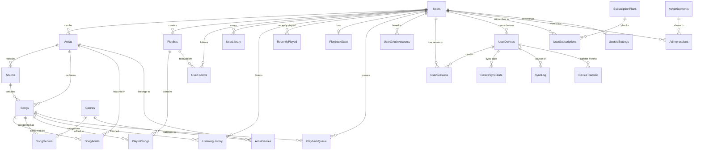

# Melodix Database Design

> **Tài liệu thiết kế database cho ứng dụng nghe nhạc Melodix**
>
> Ngày tạo: 2026-01-27

---

## Tổng quan

Thiết kế database cho ứng dụng nghe nhạc Melodix - một ứng dụng tương tự Spotify với các tính năng chính:

- Quản lý người dùng và xác thực
- **Đăng nhập bằng Google, Facebook (OAuth 2.0)**
- **Hỗ trợ cả Web và Mobile App**
- **Đồng bộ nghe nhạc giữa các thiết bị**
- **Gói Free (có quảng cáo) và Premium (không quảng cáo, Smart Shuffle)**
- Quản lý nghệ sĩ, album, bài hát
- Playlist cá nhân và cộng đồng
- Theo dõi nghệ sĩ
- Lịch sử nghe nhạc
- Thư viện cá nhân (yêu thích)

---

## Database Engine

> **Đề xuất:** PostgreSQL
>
> - Hỗ trợ tốt full-text search
> - JSON support tốt
> - Scaling capabilities

---

## Database Schema

### 1. Core Tables

---

#### Users (Người dùng)

Bảng lưu thông tin người dùng của hệ thống.

| Column              | Type         | Constraints      | Description                     |
| ------------------- | ------------ | ---------------- | ------------------------------- |
| `id`                | INTEGER      | PRIMARY KEY      | ID người dùng                   |
| `email`             | VARCHAR(255) | UNIQUE, NOT NULL | Email đăng nhập                 |
| `password_hash`     | VARCHAR(255) | NULL             | Mật khẩu (NULL nếu dùng OAuth)  |
| `username`          | VARCHAR(100) | UNIQUE, NOT NULL | Tên hiển thị                    |
| `display_name`      | VARCHAR(255) | NULL             | Tên hiển thị đầy đủ             |
| `avatar_url`        | TEXT         | NULL             | URL ảnh đại diện                |
| `date_of_birth`     | DATE         | NULL             | Ngày sinh                       |
| `country`           | VARCHAR(100) | NULL             | Quốc gia                        |
| `subscription_type` | ENUM         | DEFAULT 'free'   | 'free', 'premium', 'family'     |
| `is_artist`         | BOOLEAN      | DEFAULT false    | Có phải nghệ sĩ không           |
| `is_active`         | BOOLEAN      | DEFAULT true     | Trạng thái tài khoản            |
| `email_verified`    | BOOLEAN      | DEFAULT false    | Email đã xác thực (is_verified) |
| `otp_code`          | VARCHAR(6)   | NULL             | Mã OTP xác thực                 |
| `otp_expires_at`    | TIMESTAMP    | NULL             | Thời gian hết hạn OTP           |
| `created_at`        | TIMESTAMP    | DEFAULT NOW()    | Ngày tạo                        |
| `updated_at`        | TIMESTAMP    | DEFAULT NOW()    | Ngày cập nhật                   |

---

#### UserOAuthAccounts (Liên kết OAuth)

Bảng lưu các tài khoản OAuth liên kết với user (Google, Facebook, etc.).

| Column             | Type         | Constraints                      | Description                   |
| ------------------ | ------------ | -------------------------------- | ----------------------------- |
| `id`               | INTEGER      | PRIMARY KEY                      | ID                            |
| `user_id`          | INTEGER      | FOREIGN KEY (Users.id), NOT NULL | ID user                       |
| `provider`         | VARCHAR(50)  | NOT NULL                         | 'google', 'facebook', 'apple' |
| `provider_user_id` | VARCHAR(255) | NOT NULL                         | ID từ provider                |
| `email`            | VARCHAR(255) | NULL                             | Email từ provider             |
| `name`             | VARCHAR(255) | NULL                             | Tên từ provider               |
| `avatar_url`       | TEXT         | NULL                             | Ảnh từ provider               |
| `access_token`     | TEXT         | NULL                             | Access token (encrypted)      |
| `refresh_token`    | TEXT         | NULL                             | Refresh token (encrypted)     |
| `token_expires_at` | TIMESTAMP    | NULL                             | Thời điểm token hết hạn       |
| `created_at`       | TIMESTAMP    | DEFAULT NOW()                    | Ngày liên kết                 |
| `updated_at`       | TIMESTAMP    | DEFAULT NOW()                    | Ngày cập nhật                 |

**UNIQUE constraint:** (`provider`, `provider_user_id`)

---

#### UserSessions (Phiên đăng nhập)

Bảng lưu các phiên đăng nhập của user trên nhiều thiết bị.

| Column             | Type         | Constraints                        | Description            |
| ------------------ | ------------ | ---------------------------------- | ---------------------- |
| `id`               | INTEGER      | PRIMARY KEY                        | ID session             |
| `user_id`          | INTEGER      | FOREIGN KEY (Users.id), NOT NULL   | ID user                |
| `device_id`        | INTEGER      | FOREIGN KEY (UserDevices.id), NULL | ID thiết bị            |
| `token_hash`       | VARCHAR(255) | NOT NULL                           | Hash của refresh token |
| `ip_address`       | VARCHAR(45)  | NULL                               | Địa chỉ IP             |
| `user_agent`       | TEXT         | NULL                               | User agent             |
| `is_active`        | BOOLEAN      | DEFAULT true                       | Session còn hoạt động  |
| `expires_at`       | TIMESTAMP    | NOT NULL                           | Thời điểm hết hạn      |
| `created_at`       | TIMESTAMP    | DEFAULT NOW()                      | Ngày tạo               |
| `last_activity_at` | TIMESTAMP    | DEFAULT NOW()                      | Hoạt động lần cuối     |

---

#### UserDevices (Thiết bị người dùng)

Bảng lưu thông tin các thiết bị của user (Web, iOS, Android).

| Column         | Type         | Constraints                      | Description                         |
| -------------- | ------------ | -------------------------------- | ----------------------------------- |
| `id`           | INTEGER      | PRIMARY KEY                      | ID thiết bị                         |
| `user_id`      | INTEGER      | FOREIGN KEY (Users.id), NOT NULL | ID user                             |
| `device_type`  | ENUM         | NOT NULL                         | 'web', 'ios', 'android', 'desktop'  |
| `device_name`  | VARCHAR(255) | NULL                             | Tên thiết bị (iPhone 15, Chrome...) |
| `device_token` | TEXT         | NULL                             | Push notification token             |
| `app_version`  | VARCHAR(50)  | NULL                             | Phiên bản app                       |
| `os_version`   | VARCHAR(50)  | NULL                             | Phiên bản OS                        |
| `is_active`    | BOOLEAN      | DEFAULT true                     | Thiết bị còn hoạt động              |
| `last_sync_at` | TIMESTAMP    | NULL                             | Đồng bộ lần cuối                    |
| `created_at`   | TIMESTAMP    | DEFAULT NOW()                    | Ngày đăng ký                        |
| `updated_at`   | TIMESTAMP    | DEFAULT NOW()                    | Ngày cập nhật                       |

---

#### Artists (Nghệ sĩ)

Bảng lưu thông tin nghệ sĩ (có thể liên kết với user hoặc độc lập).

| Column              | Type         | Constraints                  | Description                      |
| ------------------- | ------------ | ---------------------------- | -------------------------------- |
| `id`                | INTEGER      | PRIMARY KEY                  | ID nghệ sĩ                       |
| `user_id`           | INTEGER      | FOREIGN KEY (Users.id), NULL | Liên kết user (nếu có tài khoản) |
| `name`              | VARCHAR(255) | NOT NULL                     | Tên nghệ sĩ                      |
| `slug`              | VARCHAR(255) | UNIQUE, NOT NULL             | URL-friendly name                |
| `bio`               | TEXT         | NULL                         | Tiểu sử                          |
| `avatar_url`        | TEXT         | NULL                         | Ảnh đại diện                     |
| `cover_url`         | TEXT         | NULL                         | Ảnh bìa                          |
| `country`           | VARCHAR(100) | NULL                         | Quốc gia                         |
| `verified`          | BOOLEAN      | DEFAULT false                | Đã xác minh                      |
| `monthly_listeners` | INTEGER      | DEFAULT 0                    | Số người nghe/tháng              |
| `created_at`        | TIMESTAMP    | DEFAULT NOW()                | Ngày tạo                         |
| `updated_at`        | TIMESTAMP    | DEFAULT NOW()                | Ngày cập nhật                    |

---

#### Genres (Thể loại)

Bảng lưu các thể loại nhạc.

| Column        | Type         | Constraints      | Description         |
| ------------- | ------------ | ---------------- | ------------------- |
| `id`          | INTEGER      | PRIMARY KEY      | ID thể loại         |
| `name`        | VARCHAR(100) | UNIQUE, NOT NULL | Tên thể loại        |
| `slug`        | VARCHAR(100) | UNIQUE, NOT NULL | URL-friendly name   |
| `description` | TEXT         | NULL             | Mô tả               |
| `cover_url`   | TEXT         | NULL             | Ảnh bìa             |
| `color`       | VARCHAR(7)   | NULL             | Màu đại diện (#hex) |
| `created_at`  | TIMESTAMP    | DEFAULT NOW()    | Ngày tạo            |

---

#### Albums

Bảng lưu thông tin album.

| Column         | Type         | Constraints                        | Description                            |
| -------------- | ------------ | ---------------------------------- | -------------------------------------- |
| `id`           | INTEGER      | PRIMARY KEY                        | ID album                               |
| `title`        | VARCHAR(255) | NOT NULL                           | Tên album                              |
| `slug`         | VARCHAR(255) | UNIQUE, NOT NULL                   | URL-friendly name                      |
| `artist_id`    | INTEGER      | FOREIGN KEY (Artists.id), NOT NULL | Nghệ sĩ chính                          |
| `album_type`   | ENUM         | DEFAULT 'album'                    | 'album', 'single', 'ep', 'compilation' |
| `cover_url`    | TEXT         | NULL                               | Ảnh bìa album                          |
| `release_date` | DATE         | NULL                               | Ngày phát hành                         |
| `total_tracks` | INTEGER      | DEFAULT 0                          | Tổng số bài                            |
| `duration_ms`  | INTEGER      | DEFAULT 0                          | Tổng thời lượng (ms)                   |
| `description`  | TEXT         | NULL                               | Mô tả                                  |
| `is_published` | BOOLEAN      | DEFAULT false                      | Đã xuất bản                            |
| `created_at`   | TIMESTAMP    | DEFAULT NOW()                      | Ngày tạo                               |
| `updated_at`   | TIMESTAMP    | DEFAULT NOW()                      | Ngày cập nhật                          |

---

#### Songs (Bài hát)

Bảng lưu thông tin bài hát.

| Column              | Type         | Constraints                        | Description              |
| ------------------- | ------------ | ---------------------------------- | ------------------------ |
| `id`                | INTEGER      | PRIMARY KEY                        | ID bài hát               |
| `title`             | VARCHAR(255) | NOT NULL                           | Tên bài hát              |
| `slug`              | VARCHAR(255) | NOT NULL                           | URL-friendly name        |
| `album_id`          | INTEGER      | FOREIGN KEY (Albums.id), NULL      | Album chứa bài hát       |
| `artist_id`         | INTEGER      | FOREIGN KEY (Artists.id), NOT NULL | Nghệ sĩ chính            |
| `genre_id`          | INTEGER      | FOREIGN KEY (Genres.id), NULL      | Thể loại chính           |
| `track_number`      | INTEGER      | NULL                               | Số thứ tự trong album    |
| `duration_ms`       | INTEGER      | NOT NULL                           | Thời lượng (ms)          |
| `audio_url`         | TEXT         | NOT NULL                           | URL file nhạc            |
| `audio_preview_url` | TEXT         | NULL                               | URL preview (30s)        |
| `cover_url`         | TEXT         | NULL                               | Ảnh bìa (override album) |
| `lyrics`            | TEXT         | NULL                               | Lời bài hát              |
| `play_count`        | BIGINT       | DEFAULT 0                          | Số lượt phát             |
| `explicit`          | BOOLEAN      | DEFAULT false                      | Nội dung nhạy cảm        |
| `is_published`      | BOOLEAN      | DEFAULT false                      | Đã xuất bản              |
| `released_at`       | TIMESTAMP    | NULL                               | Ngày phát hành           |
| `created_at`        | TIMESTAMP    | DEFAULT NOW()                      | Ngày tạo                 |
| `updated_at`        | TIMESTAMP    | DEFAULT NOW()                      | Ngày cập nhật            |

---

### 2. Relationship Tables

---

#### SongArtists (Bài hát - Nghệ sĩ)

Bảng quan hệ nhiều-nhiều giữa bài hát và nghệ sĩ (featuring, collaboration).

| Column       | Type      | Constraints                        | Description                                   |
| ------------ | --------- | ---------------------------------- | --------------------------------------------- |
| `id`         | INTEGER   | PRIMARY KEY                        | ID                                            |
| `song_id`    | INTEGER   | FOREIGN KEY (Songs.id), NOT NULL   | ID bài hát                                    |
| `artist_id`  | INTEGER   | FOREIGN KEY (Artists.id), NOT NULL | ID nghệ sĩ                                    |
| `role`       | ENUM      | DEFAULT 'primary'                  | 'primary', 'featured', 'composer', 'producer' |
| `created_at` | TIMESTAMP | DEFAULT NOW()                      | Ngày tạo                                      |

**UNIQUE constraint:** (`song_id`, `artist_id`, `role`)

---

#### SongGenres (Bài hát - Thể loại)

Bảng quan hệ nhiều-nhiều giữa bài hát và thể loại.

| Column     | Type    | Constraints                       | Description |
| ---------- | ------- | --------------------------------- | ----------- |
| `song_id`  | INTEGER | FOREIGN KEY (Songs.id), NOT NULL  | ID bài hát  |
| `genre_id` | INTEGER | FOREIGN KEY (Genres.id), NOT NULL | ID thể loại |

**PRIMARY KEY:** (`song_id`, `genre_id`)

---

#### ArtistGenres (Nghệ sĩ - Thể loại)

Bảng quan hệ nhiều-nhiều giữa nghệ sĩ và thể loại.

| Column      | Type    | Constraints                        | Description |
| ----------- | ------- | ---------------------------------- | ----------- |
| `artist_id` | INTEGER | FOREIGN KEY (Artists.id), NOT NULL | ID nghệ sĩ  |
| `genre_id`  | INTEGER | FOREIGN KEY (Genres.id), NOT NULL  | ID thể loại |

**PRIMARY KEY:** (`artist_id`, `genre_id`)

---

### 3. Playlist Tables

---

#### Playlists

Bảng lưu thông tin playlist.

| Column             | Type         | Constraints                      | Description       |
| ------------------ | ------------ | -------------------------------- | ----------------- |
| `id`               | INTEGER      | PRIMARY KEY                      | ID playlist       |
| `user_id`          | INTEGER      | FOREIGN KEY (Users.id), NOT NULL | Người tạo         |
| `name`             | VARCHAR(255) | NOT NULL                         | Tên playlist      |
| `slug`             | VARCHAR(255) | NOT NULL                         | URL-friendly name |
| `description`      | TEXT         | NULL                             | Mô tả             |
| `cover_url`        | TEXT         | NULL                             | Ảnh bìa           |
| `is_public`        | BOOLEAN      | DEFAULT true                     | Công khai         |
| `is_collaborative` | BOOLEAN      | DEFAULT false                    | Cho phép cộng tác |
| `total_tracks`     | INTEGER      | DEFAULT 0                        | Tổng số bài       |
| `duration_ms`      | INTEGER      | DEFAULT 0                        | Tổng thời lượng   |
| `created_at`       | TIMESTAMP    | DEFAULT NOW()                    | Ngày tạo          |
| `updated_at`       | TIMESTAMP    | DEFAULT NOW()                    | Ngày cập nhật     |

---

#### PlaylistSongs (Playlist - Bài hát)

Bảng quan hệ giữa playlist và bài hát.

| Column        | Type      | Constraints                          | Description           |
| ------------- | --------- | ------------------------------------ | --------------------- |
| `id`          | INTEGER   | PRIMARY KEY                          | ID                    |
| `playlist_id` | INTEGER   | FOREIGN KEY (Playlists.id), NOT NULL | ID playlist           |
| `song_id`     | INTEGER   | FOREIGN KEY (Songs.id), NOT NULL     | ID bài hát            |
| `position`    | INTEGER   | NOT NULL                             | Vị trí trong playlist |
| `added_by`    | INTEGER   | FOREIGN KEY (Users.id), NULL         | Người thêm            |
| `added_at`    | TIMESTAMP | DEFAULT NOW()                        | Ngày thêm             |

**UNIQUE constraint:** (`playlist_id`, `song_id`)

---

### 4. User Interaction Tables

---

#### UserFollows (Theo dõi)

Bảng lưu quan hệ theo dõi (user theo dõi artist hoặc user khác).

| Column           | Type      | Constraints                      | Description                  |
| ---------------- | --------- | -------------------------------- | ---------------------------- |
| `id`             | INTEGER   | PRIMARY KEY                      | ID                           |
| `follower_id`    | INTEGER   | FOREIGN KEY (Users.id), NOT NULL | Người theo dõi               |
| `following_type` | ENUM      | NOT NULL                         | 'artist', 'user', 'playlist' |
| `following_id`   | INTEGER   | NOT NULL                         | ID đối tượng được theo dõi   |
| `created_at`     | TIMESTAMP | DEFAULT NOW()                    | Ngày theo dõi                |

**UNIQUE constraint:** (`follower_id`, `following_type`, `following_id`)

---

#### UserLibrary (Thư viện cá nhân)

Bảng lưu các item user đã lưu/yêu thích.

| Column       | Type      | Constraints                      | Description                           |
| ------------ | --------- | -------------------------------- | ------------------------------------- |
| `id`         | INTEGER   | PRIMARY KEY                      | ID                                    |
| `user_id`    | INTEGER   | FOREIGN KEY (Users.id), NOT NULL | ID user                               |
| `item_type`  | ENUM      | NOT NULL                         | 'song', 'album', 'playlist', 'artist' |
| `item_id`    | INTEGER   | NOT NULL                         | ID đối tượng                          |
| `created_at` | TIMESTAMP | DEFAULT NOW()                    | Ngày lưu                              |

**UNIQUE constraint:** (`user_id`, `item_type`, `item_id`)

---

#### ListeningHistory (Lịch sử nghe)

Bảng lưu lịch sử nghe nhạc chi tiết.

| Column                 | Type      | Constraints                      | Description                                      |
| ---------------------- | --------- | -------------------------------- | ------------------------------------------------ |
| `id`                   | INTEGER   | PRIMARY KEY                      | ID                                               |
| `user_id`              | INTEGER   | FOREIGN KEY (Users.id), NOT NULL | ID user                                          |
| `song_id`              | INTEGER   | FOREIGN KEY (Songs.id), NOT NULL | ID bài hát                                       |
| `listened_at`          | TIMESTAMP | DEFAULT NOW()                    | Thời điểm nghe                                   |
| `duration_listened_ms` | INTEGER   | NULL                             | Thời lượng đã nghe (ms)                          |
| `context_type`         | ENUM      | NULL                             | 'album', 'playlist', 'artist', 'search', 'radio' |
| `context_id`           | INTEGER   | NULL                             | ID context                                       |

**INDEX:** (`user_id`, `listened_at` DESC)

---

#### RecentlyPlayed (Phát gần đây)

Bảng lưu danh sách phát gần đây (giới hạn 50 item/user).

| Column      | Type      | Constraints                      | Description                           |
| ----------- | --------- | -------------------------------- | ------------------------------------- |
| `id`        | INTEGER   | PRIMARY KEY                      | ID                                    |
| `user_id`   | INTEGER   | FOREIGN KEY (Users.id), NOT NULL | ID user                               |
| `item_type` | ENUM      | NOT NULL                         | 'song', 'album', 'playlist', 'artist' |
| `item_id`   | INTEGER   | NOT NULL                         | ID đối tượng                          |
| `played_at` | TIMESTAMP | DEFAULT NOW()                    | Thời điểm phát                        |

**UNIQUE constraint:** (`user_id`, `item_type`, `item_id`)

---

### 5. Queue & Playback Tables

---

#### PlaybackQueue (Hàng đợi phát)

Bảng lưu hàng đợi phát nhạc của user.

| Column     | Type      | Constraints                      | Description        |
| ---------- | --------- | -------------------------------- | ------------------ |
| `id`       | INTEGER   | PRIMARY KEY                      | ID                 |
| `user_id`  | INTEGER   | FOREIGN KEY (Users.id), NOT NULL | ID user            |
| `song_id`  | INTEGER   | FOREIGN KEY (Songs.id), NOT NULL | ID bài hát         |
| `position` | INTEGER   | NOT NULL                         | Vị trí trong queue |
| `added_at` | TIMESTAMP | DEFAULT NOW()                    | Ngày thêm          |

---

#### PlaybackState (Trạng thái phát - Đồng bộ multi-device)

Bảng lưu trạng thái phát nhạc hiện tại của user. **Được đồng bộ real-time giữa web và app.**

| Column             | Type      | Constraints                         | Description                   |
| ------------------ | --------- | ----------------------------------- | ----------------------------- |
| `user_id`          | INTEGER   | PRIMARY KEY, FOREIGN KEY (Users.id) | ID user                       |
| `current_song_id`  | INTEGER   | FOREIGN KEY (Songs.id), NULL        | Bài đang phát                 |
| `progress_ms`      | INTEGER   | DEFAULT 0                           | Vị trí hiện tại (ms)          |
| `is_playing`       | BOOLEAN   | DEFAULT false                       | Đang phát                     |
| `shuffle_mode`     | ENUM      | DEFAULT 'off'                       | 'off', 'normal', 'smart'      |
| `repeat_mode`      | ENUM      | DEFAULT 'off'                       | 'off', 'all', 'one'           |
| `volume`           | INTEGER   | DEFAULT 100                         | Âm lượng (0-100)              |
| `context_type`     | ENUM      | NULL                                | 'album', 'playlist', 'artist' |
| `context_id`       | INTEGER   | NULL                                | ID context                    |
| `active_device_id` | INTEGER   | FOREIGN KEY (UserDevices.id), NULL  | Thiết bị đang active          |
| `updated_at`       | TIMESTAMP | DEFAULT NOW()                       | Cập nhật lần cuối             |

> **Lưu ý:** `shuffle_mode = 'smart'` chỉ khả dụng cho user Premium. Smart Shuffle sử dụng AI/ML để chọn bài dựa trên lịch sử nghe và sở thích của user.

---

### 6. Device Sync Tables

---

#### DeviceSyncState (Trạng thái đồng bộ thiết bị)

Bảng lưu trạng thái đồng bộ giữa các thiết bị.

| Column              | Type      | Constraints                            | Description                                 |
| ------------------- | --------- | -------------------------------------- | ------------------------------------------- |
| `id`                | INTEGER   | PRIMARY KEY                            | ID                                          |
| `user_id`           | INTEGER   | FOREIGN KEY (Users.id), NOT NULL       | ID user                                     |
| `device_id`         | INTEGER   | FOREIGN KEY (UserDevices.id), NOT NULL | ID thiết bị                                 |
| `sync_type`         | ENUM      | NOT NULL                               | 'library', 'playlists', 'playback', 'queue' |
| `last_sync_version` | BIGINT    | DEFAULT 0                              | Version đã sync                             |
| `last_sync_at`      | TIMESTAMP | NULL                                   | Thời điểm sync cuối                         |
| `pending_changes`   | INTEGER   | DEFAULT 0                              | Số thay đổi chưa sync                       |

**UNIQUE constraint:** (`user_id`, `device_id`, `sync_type`)

---

#### SyncLog (Nhật ký đồng bộ)

Bảng lưu log các thay đổi cần đồng bộ giữa các thiết bị.

| Column             | Type        | Constraints                        | Description                       |
| ------------------ | ----------- | ---------------------------------- | --------------------------------- |
| `id`               | INTEGER     | PRIMARY KEY                        | ID                                |
| `user_id`          | INTEGER     | FOREIGN KEY (Users.id), NOT NULL   | ID user                           |
| `entity_type`      | VARCHAR(50) | NOT NULL                           | 'playlist', 'library', 'playback' |
| `entity_id`        | INTEGER     | NOT NULL                           | ID đối tượng                      |
| `action`           | ENUM        | NOT NULL                           | 'create', 'update', 'delete'      |
| `version`          | BIGINT      | NOT NULL                           | Version number                    |
| `payload`          | JSONB       | NULL                               | Dữ liệu thay đổi                  |
| `source_device_id` | INTEGER     | FOREIGN KEY (UserDevices.id), NULL | Thiết bị tạo thay đổi             |
| `created_at`       | TIMESTAMP   | DEFAULT NOW()                      | Thời điểm tạo                     |

**INDEX:** (`user_id`, `version` DESC)

---

#### DeviceTransfer (Chuyển phát giữa thiết bị)

Bảng lưu yêu cầu chuyển phát nhạc giữa các thiết bị (giống Spotify Connect).

| Column           | Type      | Constraints                            | Description                                  |
| ---------------- | --------- | -------------------------------------- | -------------------------------------------- |
| `id`             | INTEGER   | PRIMARY KEY                            | ID                                           |
| `user_id`        | INTEGER   | FOREIGN KEY (Users.id), NOT NULL       | ID user                                      |
| `from_device_id` | INTEGER   | FOREIGN KEY (UserDevices.id), NOT NULL | Thiết bị nguồn                               |
| `to_device_id`   | INTEGER   | FOREIGN KEY (UserDevices.id), NOT NULL | Thiết bị đích                                |
| `status`         | ENUM      | DEFAULT 'pending'                      | 'pending', 'accepted', 'rejected', 'expired' |
| `transfer_data`  | JSONB     | NULL                                   | Dữ liệu chuyển (song, progress, queue)       |
| `created_at`     | TIMESTAMP | DEFAULT NOW()                          | Thời điểm yêu cầu                            |
| `expires_at`     | TIMESTAMP | NOT NULL                               | Thời điểm hết hạn                            |

---

### 7. Subscription & Ads Tables

---

#### SubscriptionPlans (Gói đăng ký)

Bảng lưu các gói đăng ký có sẵn trong hệ thống.

| Column          | Type          | Constraints      | Description                           |
| --------------- | ------------- | ---------------- | ------------------------------------- |
| `id`            | INTEGER       | PRIMARY KEY      | ID gói                                |
| `name`          | VARCHAR(100)  | UNIQUE, NOT NULL | Tên gói ('Free', 'Premium', 'Family') |
| `slug`          | VARCHAR(100)  | UNIQUE, NOT NULL | URL slug                              |
| `description`   | TEXT          | NULL             | Mô tả gói                             |
| `price_monthly` | DECIMAL(10,2) | DEFAULT 0        | Giá tháng                             |
| `price_yearly`  | DECIMAL(10,2) | DEFAULT 0        | Giá năm                               |
| `currency`      | VARCHAR(3)    | DEFAULT 'VND'    | Loại tiền tệ                          |
| `max_devices`   | INTEGER       | DEFAULT 1        | Số thiết bị tối đa                    |
| `has_ads`       | BOOLEAN       | DEFAULT true     | Có quảng cáo                          |
| `can_download`  | BOOLEAN       | DEFAULT false    | Cho phép tải offline                  |
| `audio_quality` | ENUM          | DEFAULT 'normal' | 'normal', 'high', 'lossless'          |
| `smart_shuffle` | BOOLEAN       | DEFAULT false    | Trộn bài thông minh                   |
| `skip_limit`    | INTEGER       | DEFAULT 6        | Giới hạn skip/giờ (NULL = unlimited)  |
| `is_active`     | BOOLEAN       | DEFAULT true     | Gói còn hoạt động                     |
| `created_at`    | TIMESTAMP     | DEFAULT NOW()    | Ngày tạo                              |

**Gói mẫc định:**

- **Free:** Có quảng cáo, giới hạn skip, chất lượng nhạc thường
- **Premium:** Không quảng cáo, Smart Shuffle, tải offline, chất lượng cao
- **Family:** Như Premium nhưng cho 6 người

---

#### UserSubscriptions (Lịch sử đăng ký user)

Bảng lưu lịch sử đăng ký gói của user.

| Column              | Type        | Constraints                                  | Description                                |
| ------------------- | ----------- | -------------------------------------------- | ------------------------------------------ |
| `id`                | INTEGER     | PRIMARY KEY                                  | ID                                         |
| `user_id`           | INTEGER     | FOREIGN KEY (Users.id), NOT NULL             | ID user                                    |
| `plan_id`           | INTEGER     | FOREIGN KEY (SubscriptionPlans.id), NOT NULL | ID gói                                     |
| `status`            | ENUM        | DEFAULT 'active'                             | 'active', 'cancelled', 'expired', 'paused' |
| `billing_cycle`     | ENUM        | DEFAULT 'monthly'                            | 'monthly', 'yearly'                        |
| `start_date`        | TIMESTAMP   | NOT NULL                                     | Ngày bắt đầu                               |
| `end_date`          | TIMESTAMP   | NULL                                         | Ngày kết thúc                              |
| `next_billing_date` | TIMESTAMP   | NULL                                         | Ngày thanh toán tiếp                       |
| `cancelled_at`      | TIMESTAMP   | NULL                                         | Ngày hủy                                   |
| `payment_method`    | VARCHAR(50) | NULL                                         | Phương thức thanh toán                     |
| `created_at`        | TIMESTAMP   | DEFAULT NOW()                                | Ngày tạo                                   |
| `updated_at`        | TIMESTAMP   | DEFAULT NOW()                                | Ngày cập nhật                              |

---

#### Advertisements (Quảng cáo)

Bảng lưu thông tin quảng cáo trong hệ thống.

| Column                | Type          | Constraints   | Description                           |
| --------------------- | ------------- | ------------- | ------------------------------------- |
| `id`                  | INTEGER       | PRIMARY KEY   | ID quảng cáo                          |
| `name`                | VARCHAR(255)  | NOT NULL      | Tên quảng cáo                         |
| `advertiser`          | VARCHAR(255)  | NOT NULL      | Tên nhà quảng cáo                     |
| `ad_type`             | ENUM          | NOT NULL      | 'audio', 'banner', 'video', 'popup'   |
| `media_url`           | TEXT          | NOT NULL      | URL file quảng cáo                    |
| `click_url`           | TEXT          | NULL          | URL khi click                         |
| `duration_ms`         | INTEGER       | NULL          | Thời lượng (cho audio/video)          |
| `target_countries`    | TEXT[]        | NULL          | Quốc gia mục tiêu                     |
| `target_age_min`      | INTEGER       | NULL          | Tuổi tối thiểu                        |
| `target_age_max`      | INTEGER       | NULL          | Tuổi tối đa                           |
| `target_genres`       | INTEGER[]     | NULL          | Thể loại nhạc mục tiêu                |
| `priority`            | INTEGER       | DEFAULT 1     | Độ ưu tiên (cao hơn = hiện nhiều hơn) |
| `budget`              | DECIMAL(12,2) | NULL          | Ngân sách                             |
| `cost_per_impression` | DECIMAL(8,4)  | NULL          | Chi phí mỗi lần hiển thị              |
| `cost_per_click`      | DECIMAL(8,4)  | NULL          | Chi phí mỗi click                     |
| `total_impressions`   | BIGINT        | DEFAULT 0     | Tổng số lần hiển thị                  |
| `total_clicks`        | BIGINT        | DEFAULT 0     | Tổng số click                         |
| `start_date`          | TIMESTAMP     | NULL          | Ngày bắt đầu chạy                     |
| `end_date`            | TIMESTAMP     | NULL          | Ngày kết thúc                         |
| `is_active`           | BOOLEAN       | DEFAULT true  | Đang hoạt động                        |
| `created_at`          | TIMESTAMP     | DEFAULT NOW() | Ngày tạo                              |
| `updated_at`          | TIMESTAMP     | DEFAULT NOW() | Ngày cập nhật                         |

---

#### AdImpressions (Lịch sử hiển thị quảng cáo)

Bảng lưu lịch sử hiển thị quảng cáo cho user.

| Column            | Type         | Constraints                               | Description                           |
| ----------------- | ------------ | ----------------------------------------- | ------------------------------------- |
| `id`              | INTEGER      | PRIMARY KEY                               | ID                                    |
| `user_id`         | INTEGER      | FOREIGN KEY (Users.id), NOT NULL          | ID user                               |
| `ad_id`           | INTEGER      | FOREIGN KEY (Advertisements.id), NOT NULL | ID quảng cáo                          |
| `device_id`       | INTEGER      | FOREIGN KEY (UserDevices.id), NULL        | Thiết bị xem                          |
| `impression_type` | ENUM         | NOT NULL                                  | 'view', 'click', 'skip', 'complete'   |
| `context_type`    | ENUM         | NULL                                      | 'between_songs', 'app_open', 'browse' |
| `revenue`         | DECIMAL(8,4) | DEFAULT 0                                 | Doanh thu từ impression               |
| `created_at`      | TIMESTAMP    | DEFAULT NOW()                             | Thời điểm hiển thị                    |

**INDEX:** (`user_id`, `created_at` DESC)

---

#### UserAdSettings (Cài đặt quảng cáo user)

Bảng lưu cài đặt quảng cáo của user (cho Free users).

| Column                | Type      | Constraints                         | Description                |
| --------------------- | --------- | ----------------------------------- | -------------------------- |
| `user_id`             | INTEGER   | PRIMARY KEY, FOREIGN KEY (Users.id) | ID user                    |
| `last_ad_shown_at`    | TIMESTAMP | NULL                                | Lần cuối xem quảng cáo     |
| `songs_since_last_ad` | INTEGER   | DEFAULT 0                           | Số bài từ lần cuối xem ad  |
| `ads_per_hour`        | INTEGER   | DEFAULT 4                           | Số quảng cáo mỗi giờ       |
| `skip_count_today`    | INTEGER   | DEFAULT 0                           | Số lần skip hôm nay        |
| `skip_reset_at`       | TIMESTAMP | NULL                                | Thời điểm reset skip count |
| `updated_at`          | TIMESTAMP | DEFAULT NOW()                       | Cập nhật lần cuối          |

---

## Entity Relationship Diagram



---

## Indexes Recommendation

```sql
-- Users
CREATE INDEX idx_users_email ON users(email);
CREATE INDEX idx_users_username ON users(username);

-- Artists
CREATE INDEX idx_artists_slug ON artists(slug);
CREATE INDEX idx_artists_user_id ON artists(user_id);

-- Albums
CREATE INDEX idx_albums_artist_id ON albums(artist_id);
CREATE INDEX idx_albums_release_date ON albums(release_date);

-- Songs
CREATE INDEX idx_songs_album_id ON songs(album_id);
CREATE INDEX idx_songs_artist_id ON songs(artist_id);
CREATE INDEX idx_songs_play_count ON songs(play_count DESC);
CREATE INDEX idx_songs_released_at ON songs(released_at);

-- Playlists
CREATE INDEX idx_playlists_user_id ON playlists(user_id);
CREATE INDEX idx_playlists_is_public ON playlists(is_public);

-- PlaylistSongs
CREATE INDEX idx_playlist_songs_playlist_id ON playlist_songs(playlist_id);
CREATE INDEX idx_playlist_songs_position ON playlist_songs(playlist_id, position);

-- ListeningHistory
CREATE INDEX idx_listening_history_user_id ON listening_history(user_id);
CREATE INDEX idx_listening_history_listened_at ON listening_history(user_id, listened_at DESC);
CREATE INDEX idx_listening_history_song_id ON listening_history(song_id);

-- UserLibrary
CREATE INDEX idx_user_library_user_id ON user_library(user_id);
CREATE INDEX idx_user_library_item ON user_library(item_type, item_id);

-- UserFollows
CREATE INDEX idx_user_follows_follower ON user_follows(follower_id);
CREATE INDEX idx_user_follows_following ON user_follows(following_type, following_id);

-- DeviceSyncState
CREATE INDEX idx_device_sync_user ON device_sync_state(user_id);
CREATE INDEX idx_device_sync_device ON device_sync_state(device_id);

-- SyncLog
CREATE INDEX idx_sync_log_user ON sync_log(user_id);
CREATE INDEX idx_sync_log_version ON sync_log(user_id, version DESC);
CREATE INDEX idx_sync_log_entity ON sync_log(entity_type, entity_id);

-- DeviceTransfer
CREATE INDEX idx_device_transfer_user ON device_transfer(user_id);
CREATE INDEX idx_device_transfer_status ON device_transfer(status, expires_at);

-- SubscriptionPlans
CREATE INDEX idx_subscription_plans_active ON subscription_plans(is_active);

-- UserSubscriptions
CREATE INDEX idx_user_subscriptions_user ON user_subscriptions(user_id);
CREATE INDEX idx_user_subscriptions_status ON user_subscriptions(user_id, status);
CREATE INDEX idx_user_subscriptions_billing ON user_subscriptions(next_billing_date);

-- Advertisements
CREATE INDEX idx_ads_active ON advertisements(is_active);
CREATE INDEX idx_ads_type ON advertisements(ad_type, is_active);
CREATE INDEX idx_ads_dates ON advertisements(start_date, end_date);

-- AdImpressions
CREATE INDEX idx_ad_impressions_user ON ad_impressions(user_id);
CREATE INDEX idx_ad_impressions_ad ON ad_impressions(ad_id);
CREATE INDEX idx_ad_impressions_date ON ad_impressions(user_id, created_at DESC);
```

---

## SQL Migration Scripts

### Create Tables (PostgreSQL)

```sql
-- Enabl INTEGER extension
CREATE EXTENSION IF NOT EXISTS "uuid-ossp";

-- Create ENUM types
CREATE TYPE subscription_type AS ENUM ('free', 'premium', 'family');
CREATE TYPE album_type AS ENUM ('album', 'single', 'ep', 'compilation');
CREATE TYPE artist_role AS ENUM ('primary', 'featured', 'composer', 'producer');
CREATE TYPE follow_type AS ENUM ('artist', 'user', 'playlist');
CREATE TYPE library_item_type AS ENUM ('song', 'album', 'playlist', 'artist');
CREATE TYPE context_type AS ENUM ('album', 'playlist', 'artist', 'search', 'radio');
CREATE TYPE repeat_mode AS ENUM ('off', 'all', 'one');

-- Users table
CREATE TABLE users (
    id SERIAL,
    email VARCHAR(255) UNIQUE NOT NULL,
    password_hash VARCHAR(255) NOT NULL,
    username VARCHAR(100) UNIQUE NOT NULL,
    display_name VARCHAR(255),
    avatar_url TEXT,
    date_of_birth DATE,
    country VARCHAR(100),
    subscription_type subscription_type DEFAULT 'free',
    is_artist BOOLEAN DEFAULT false,
    is_active BOOLEAN DEFAULT true,
    created_at TIMESTAMP DEFAULT NOW(),
    updated_at TIMESTAMP DEFAULT NOW()
);

-- Artists table
CREATE TABLE artists (
    id SERIAL,
    user_id INTEGER REFERENCES users(id) ON DELETE SET NULL,
    name VARCHAR(255) NOT NULL,
    slug VARCHAR(255) UNIQUE NOT NULL,
    bio TEXT,
    avatar_url TEXT,
    cover_url TEXT,
    country VARCHAR(100),
    verified BOOLEAN DEFAULT false,
    monthly_listeners INTEGER DEFAULT 0,
    created_at TIMESTAMP DEFAULT NOW(),
    updated_at TIMESTAMP DEFAULT NOW()
);

-- Genres table
CREATE TABLE genres (
    id SERIAL,
    name VARCHAR(100) UNIQUE NOT NULL,
    slug VARCHAR(100) UNIQUE NOT NULL,
    description TEXT,
    cover_url TEXT,
    color VARCHAR(7),
    created_at TIMESTAMP DEFAULT NOW()
);

-- Albums table
CREATE TABLE albums (
    id SERIAL,
    title VARCHAR(255) NOT NULL,
    slug VARCHAR(255) UNIQUE NOT NULL,
    artist_id INTEGER NOT NULL REFERENCES artists(id) ON DELETE CASCADE,
    album_type album_type DEFAULT 'album',
    cover_url TEXT,
    release_date DATE,
    total_tracks INTEGER DEFAULT 0,
    duration_ms INTEGER DEFAULT 0,
    description TEXT,
    is_published BOOLEAN DEFAULT false,
    created_at TIMESTAMP DEFAULT NOW(),
    updated_at TIMESTAMP DEFAULT NOW()
);

-- Songs table
CREATE TABLE songs (
    id SERIAL,
    title VARCHAR(255) NOT NULL,
    slug VARCHAR(255) NOT NULL,
    album_id INTEGER REFERENCES albums(id) ON DELETE SET NULL,
    artist_id INTEGER NOT NULL REFERENCES artists(id) ON DELETE CASCADE,
    genre_id INTEGER REFERENCES genres(id) ON DELETE SET NULL,
    track_number INTEGER,
    duration_ms INTEGER NOT NULL,
    audio_url TEXT NOT NULL,
    audio_preview_url TEXT,
    cover_url TEXT,
    lyrics TEXT,
    play_count BIGINT DEFAULT 0,
    explicit BOOLEAN DEFAULT false,
    is_published BOOLEAN DEFAULT false,
    released_at TIMESTAMP,
    created_at TIMESTAMP DEFAULT NOW(),
    updated_at TIMESTAMP DEFAULT NOW()
);

-- SongArtists table
CREATE TABLE song_artists (
    id SERIAL,
    song_id INTEGER NOT NULL REFERENCES songs(id) ON DELETE CASCADE,
    artist_id INTEGER NOT NULL REFERENCES artists(id) ON DELETE CASCADE,
    role artist_role DEFAULT 'primary',
    created_at TIMESTAMP DEFAULT NOW(),
    UNIQUE(song_id, artist_id, role)
);

-- SongGenres table
CREATE TABLE song_genres (
    song_id INTEGER NOT NULL REFERENCES songs(id) ON DELETE CASCADE,
    genre_id INTEGER NOT NULL REFERENCES genres(id) ON DELETE CASCADE,
    PRIMARY KEY (song_id, genre_id)
);

-- ArtistGenres table
CREATE TABLE artist_genres (
    artist_id INTEGER NOT NULL REFERENCES artists(id) ON DELETE CASCADE,
    genre_id INTEGER NOT NULL REFERENCES genres(id) ON DELETE CASCADE,
    PRIMARY KEY (artist_id, genre_id)
);

-- Playlists table
CREATE TABLE playlists (
    id SERIAL,
    user_id INTEGER NOT NULL REFERENCES users(id) ON DELETE CASCADE,
    name VARCHAR(255) NOT NULL,
    slug VARCHAR(255) NOT NULL,
    description TEXT,
    cover_url TEXT,
    is_public BOOLEAN DEFAULT true,
    is_collaborative BOOLEAN DEFAULT false,
    total_tracks INTEGER DEFAULT 0,
    duration_ms INTEGER DEFAULT 0,
    created_at TIMESTAMP DEFAULT NOW(),
    updated_at TIMESTAMP DEFAULT NOW()
);

-- PlaylistSongs table
CREATE TABLE playlist_songs (
    id SERIAL,
    playlist_id INTEGER NOT NULL REFERENCES playlists(id) ON DELETE CASCADE,
    song_id INTEGER NOT NULL REFERENCES songs(id) ON DELETE CASCADE,
    position INTEGER NOT NULL,
    added_by INTEGER REFERENCES users(id) ON DELETE SET NULL,
    added_at TIMESTAMP DEFAULT NOW(),
    UNIQUE(playlist_id, song_id)
);

-- UserFollows table
CREATE TABLE user_follows (
    id SERIAL,
    follower_id INTEGER NOT NULL REFERENCES users(id) ON DELETE CASCADE,
    following_type follow_type NOT NULL,
    following_id INTEGER NOT NULL,
    created_at TIMESTAMP DEFAULT NOW(),
    UNIQUE(follower_id, following_type, following_id)
);

-- UserLibrary table
CREATE TABLE user_library (
    id SERIAL,
    user_id INTEGER NOT NULL REFERENCES users(id) ON DELETE CASCADE,
    item_type library_item_type NOT NULL,
    item_id INTEGER NOT NULL,
    created_at TIMESTAMP DEFAULT NOW(),
    UNIQUE(user_id, item_type, item_id)
);

-- ListeningHistory table
CREATE TABLE listening_history (
    id SERIAL,
    user_id INTEGER NOT NULL REFERENCES users(id) ON DELETE CASCADE,
    song_id INTEGER NOT NULL REFERENCES songs(id) ON DELETE CASCADE,
    listened_at TIMESTAMP DEFAULT NOW(),
    duration_listened_ms INTEGER,
    context_type context_type,
    context_id INTEGER
);

-- RecentlyPlayed table
CREATE TABLE recently_played (
    id SERIAL,
    user_id INTEGER NOT NULL REFERENCES users(id) ON DELETE CASCADE,
    item_type library_item_type NOT NULL,
    item_id INTEGER NOT NULL,
    played_at TIMESTAMP DEFAULT NOW(),
    UNIQUE(user_id, item_type, item_id)
);

-- PlaybackQueue table
CREATE TABLE playback_queue (
    id SERIAL,
    user_id INTEGER NOT NULL REFERENCES users(id) ON DELETE CASCADE,
    song_id INTEGER NOT NULL REFERENCES songs(id) ON DELETE CASCADE,
    position INTEGER NOT NULL,
    added_at TIMESTAMP DEFAULT NOW()
);

-- PlaybackState table
CREATE TABLE playback_state (
    user_id INTEGER PRIMARY KEY REFERENCES users(id) ON DELETE CASCADE,
    current_song_id INTEGER REFERENCES songs(id) ON DELETE SET NULL,
    progress_ms INTEGER DEFAULT 0,
    is_playing BOOLEAN DEFAULT false,
    shuffle_mode BOOLEAN DEFAULT false,
    repeat_mode repeat_mode DEFAULT 'off',
    volume INTEGER DEFAULT 100,
    context_type context_type,
    context_id INTEGER,
    active_device_id INTEGER REFERENCES user_devices(id) ON DELETE SET NULL,
    updated_at TIMESTAMP DEFAULT NOW()
);

-- =====================================================
-- OAUTH & AUTHENTICATION TABLES
-- =====================================================

-- UserOAuthAccounts table (Google, Facebook, Apple login)
CREATE TABLE user_oauth_accounts (
    id SERIAL,
    user_id INTEGER NOT NULL REFERENCES users(id) ON DELETE CASCADE,
    provider VARCHAR(50) NOT NULL,
    provider_user_id VARCHAR(255) NOT NULL,
    email VARCHAR(255),
    name VARCHAR(255),
    avatar_url TEXT,
    access_token TEXT,
    refresh_token TEXT,
    token_expires_at TIMESTAMP,
    created_at TIMESTAMP DEFAULT NOW(),
    updated_at TIMESTAMP DEFAULT NOW(),
    UNIQUE(provider, provider_user_id)
);

-- UserSessions table (Multi-device sessions)
CREATE TABLE user_sessions (
    id SERIAL,
    user_id INTEGER NOT NULL REFERENCES users(id) ON DELETE CASCADE,
    device_id INTEGER REFERENCES user_devices(id) ON DELETE SET NULL,
    token_hash VARCHAR(255) NOT NULL,
    ip_address VARCHAR(45),
    user_agent TEXT,
    is_active BOOLEAN DEFAULT true,
    expires_at TIMESTAMP NOT NULL,
    created_at TIMESTAMP DEFAULT NOW(),
    last_activity_at TIMESTAMP DEFAULT NOW()
);

-- UserDevices table (Web, iOS, Android devices)
CREATE TYPE device_type AS ENUM ('web', 'ios', 'android', 'desktop');

CREATE TABLE user_devices (
    id SERIAL,
    user_id INTEGER NOT NULL REFERENCES users(id) ON DELETE CASCADE,
    device_type device_type NOT NULL,
    device_name VARCHAR(255),
    device_token TEXT,
    app_version VARCHAR(50),
    os_version VARCHAR(50),
    is_active BOOLEAN DEFAULT true,
    last_sync_at TIMESTAMP,
    created_at TIMESTAMP DEFAULT NOW(),
    updated_at TIMESTAMP DEFAULT NOW()
);

-- =====================================================
-- DEVICE SYNC TABLES (Spotify Connect-like feature)
-- =====================================================

-- DeviceSyncState table
CREATE TYPE sync_type AS ENUM ('library', 'playlists', 'playback', 'queue');

CREATE TABLE device_sync_state (
    id SERIAL,
    user_id INTEGER NOT NULL REFERENCES users(id) ON DELETE CASCADE,
    device_id INTEGER NOT NULL REFERENCES user_devices(id) ON DELETE CASCADE,
    sync_type sync_type NOT NULL,
    last_sync_version BIGINT DEFAULT 0,
    last_sync_at TIMESTAMP,
    pending_changes INTEGER DEFAULT 0,
    UNIQUE(user_id, device_id, sync_type)
);

-- SyncLog table (Change tracking for sync)
CREATE TYPE sync_action AS ENUM ('create', 'update', 'delete');

CREATE TABLE sync_log (
    id SERIAL,
    user_id INTEGER NOT NULL REFERENCES users(id) ON DELETE CASCADE,
    entity_type VARCHAR(50) NOT NULL,
    entity_id INTEGER NOT NULL,
    action sync_action NOT NULL,
    version BIGINT NOT NULL,
    payload JSONB,
    source_device_id INTEGER REFERENCES user_devices(id) ON DELETE SET NULL,
    created_at TIMESTAMP DEFAULT NOW()
);

-- DeviceTransfer table (Transfer playback between devices)
CREATE TYPE transfer_status AS ENUM ('pending', 'accepted', 'rejected', 'expired');

CREATE TABLE device_transfer (
    id SERIAL,
    user_id INTEGER NOT NULL REFERENCES users(id) ON DELETE CASCADE,
    from_device_id INTEGER NOT NULL REFERENCES user_devices(id) ON DELETE CASCADE,
    to_device_id INTEGER NOT NULL REFERENCES user_devices(id) ON DELETE CASCADE,
    status transfer_status DEFAULT 'pending',
    transfer_data JSONB,
    created_at TIMESTAMP DEFAULT NOW(),
    expires_at TIMESTAMP NOT NULL
);

-- =====================================================
-- SUBSCRIPTION & ADS TABLES
-- =====================================================

-- SubscriptionPlans table
CREATE TYPE audio_quality AS ENUM ('normal', 'high', 'lossless');

CREATE TABLE subscription_plans (
    id SERIAL,
    name VARCHAR(100) UNIQUE NOT NULL,
    slug VARCHAR(100) UNIQUE NOT NULL,
    description TEXT,
    price_monthly DECIMAL(10,2) DEFAULT 0,
    price_yearly DECIMAL(10,2) DEFAULT 0,
    currency VARCHAR(3) DEFAULT 'VND',
    max_devices INTEGER DEFAULT 1,
    has_ads BOOLEAN DEFAULT true,
    can_download BOOLEAN DEFAULT false,
    audio_quality audio_quality DEFAULT 'normal',
    smart_shuffle BOOLEAN DEFAULT false,
    skip_limit INTEGER DEFAULT 6,
    is_active BOOLEAN DEFAULT true,
    created_at TIMESTAMP DEFAULT NOW()
);

-- Insert default plans
INSERT INTO subscription_plans (name, slug, description, price_monthly, has_ads, can_download, audio_quality, smart_shuffle, skip_limit, max_devices) VALUES
('Free', 'free', 'Gói miễn phí với quảng cáo', 0, true, false, 'normal', false, 6, 1),
('Premium', 'premium', 'Không quảng cáo, Smart Shuffle, tải offline', 59000, false, true, 'high', true, NULL, 3),
('Family', 'family', 'Premium cho cả gia đình (6 người)', 89000, false, true, 'lossless', true, NULL, 6);

-- UserSubscriptions table
CREATE TYPE subscription_status AS ENUM ('active', 'cancelled', 'expired', 'paused');
CREATE TYPE billing_cycle AS ENUM ('monthly', 'yearly');

CREATE TABLE user_subscriptions (
    id SERIAL,
    user_id INTEGER NOT NULL REFERENCES users(id) ON DELETE CASCADE,
    plan_id INTEGER NOT NULL REFERENCES subscription_plans(id),
    status subscription_status DEFAULT 'active',
    billing_cycle billing_cycle DEFAULT 'monthly',
    start_date TIMESTAMP NOT NULL DEFAULT NOW(),
    end_date TIMESTAMP,
    next_billing_date TIMESTAMP,
    cancelled_at TIMESTAMP,
    payment_method VARCHAR(50),
    created_at TIMESTAMP DEFAULT NOW(),
    updated_at TIMESTAMP DEFAULT NOW()
);

-- Advertisements table
CREATE TYPE ad_type AS ENUM ('audio', 'banner', 'video', 'popup');

CREATE TABLE advertisements (
    id SERIAL,
    name VARCHAR(255) NOT NULL,
    advertiser VARCHAR(255) NOT NULL,
    ad_type ad_type NOT NULL,
    media_url TEXT NOT NULL,
    click_url TEXT,
    duration_ms INTEGER,
    target_countries TEXT[],
    target_age_min INTEGER,
    target_age_max INTEGER,
    target_genres INTEGER[],
    priority INTEGER DEFAULT 1,
    budget DECIMAL(12,2),
    cost_per_impression DECIMAL(8,4),
    cost_per_click DECIMAL(8,4),
    total_impressions BIGINT DEFAULT 0,
    total_clicks BIGINT DEFAULT 0,
    start_date TIMESTAMP,
    end_date TIMESTAMP,
    is_active BOOLEAN DEFAULT true,
    created_at TIMESTAMP DEFAULT NOW(),
    updated_at TIMESTAMP DEFAULT NOW()
);

-- AdImpressions table
CREATE TYPE impression_type AS ENUM ('view', 'click', 'skip', 'complete');
CREATE TYPE ad_context_type AS ENUM ('between_songs', 'app_open', 'browse');

CREATE TABLE ad_impressions (
    id SERIAL,
    user_id INTEGER NOT NULL REFERENCES users(id) ON DELETE CASCADE,
    ad_id INTEGER NOT NULL REFERENCES advertisements(id) ON DELETE CASCADE,
    device_id INTEGER REFERENCES user_devices(id) ON DELETE SET NULL,
    impression_type impression_type NOT NULL,
    context_type ad_context_type,
    revenue DECIMAL(8,4) DEFAULT 0,
    created_at TIMESTAMP DEFAULT NOW()
);

-- UserAdSettings table
CREATE TABLE user_ad_settings (
    user_id INTEGER PRIMARY KEY REFERENCES users(id) ON DELETE CASCADE,
    last_ad_shown_at TIMESTAMP,
    songs_since_last_ad INTEGER DEFAULT 0,
    ads_per_hour INTEGER DEFAULT 4,
    skip_count_today INTEGER DEFAULT 0,
    skip_reset_at TIMESTAMP,
    updated_at TIMESTAMP DEFAULT NOW()
);

-- =====================================================
-- OAUTH & AUTHENTICATION TABLES
-- =====================================================

-- UserOAuthAccounts table (Google, Facebook, Apple login)
CREATE TABLE user_oauth_accounts (
    id SERIAL,
    user_id INTEGER NOT NULL REFERENCES users(id) ON DELETE CASCADE,
    provider VARCHAR(50) NOT NULL,
    provider_user_id VARCHAR(255) NOT NULL,
    email VARCHAR(255),
    name VARCHAR(255),
    avatar_url TEXT,
    access_token TEXT,
    refresh_token TEXT,
    token_expires_at TIMESTAMP,
    created_at TIMESTAMP DEFAULT NOW(),
    updated_at TIMESTAMP DEFAULT NOW(),
    UNIQUE(provider, provider_user_id)
);

-- UserSessions table (Multi-device sessions)
CREATE TABLE user_sessions (
    id SERIAL,
    user_id INTEGER NOT NULL REFERENCES users(id) ON DELETE CASCADE,
    device_id INTEGER REFERENCES user_devices(id) ON DELETE SET NULL,
    token_hash VARCHAR(255) NOT NULL,
    ip_address VARCHAR(45),
    user_agent TEXT,
    is_active BOOLEAN DEFAULT true,
    expires_at TIMESTAMP NOT NULL,
    created_at TIMESTAMP DEFAULT NOW(),
    last_activity_at TIMESTAMP DEFAULT NOW()
);

-- UserDevices table (Web, iOS, Android devices)
CREATE TYPE device_type AS ENUM ('web', 'ios', 'android', 'desktop');

CREATE TABLE user_devices (
    id SERIAL,
    user_id INTEGER NOT NULL REFERENCES users(id) ON DELETE CASCADE,
    device_type device_type NOT NULL,
    device_name VARCHAR(255),
    device_token TEXT,
    app_version VARCHAR(50),
    os_version VARCHAR(50),
    is_active BOOLEAN DEFAULT true,
    last_sync_at TIMESTAMP,
    created_at TIMESTAMP DEFAULT NOW(),
    updated_at TIMESTAMP DEFAULT NOW()
);

-- =====================================================
-- DEVICE SYNC TABLES (Spotify Connect-like feature)
-- =====================================================

-- DeviceSyncState table
CREATE TYPE sync_type AS ENUM ('library', 'playlists', 'playback', 'queue');

CREATE TABLE device_sync_state (
    id SERIAL,
    user_id INTEGER NOT NULL REFERENCES users(id) ON DELETE CASCADE,
    device_id INTEGER NOT NULL REFERENCES user_devices(id) ON DELETE CASCADE,
    sync_type sync_type NOT NULL,
    last_sync_version BIGINT DEFAULT 0,
    last_sync_at TIMESTAMP,
    pending_changes INTEGER DEFAULT 0,
    UNIQUE(user_id, device_id, sync_type)
);

-- SyncLog table (Change tracking for sync)
CREATE TYPE sync_action AS ENUM ('create', 'update', 'delete');

CREATE TABLE sync_log (
    id SERIAL,
    user_id INTEGER NOT NULL REFERENCES users(id) ON DELETE CASCADE,
    entity_type VARCHAR(50) NOT NULL,
    entity_id INTEGER NOT NULL,
    action sync_action NOT NULL,
    version BIGINT NOT NULL,
    payload JSONB,
    source_device_id INTEGER REFERENCES user_devices(id) ON DELETE SET NULL,
    created_at TIMESTAMP DEFAULT NOW()
);

-- DeviceTransfer table (Transfer playback between devices)
CREATE TYPE transfer_status AS ENUM ('pending', 'accepted', 'rejected', 'expired');

CREATE TABLE device_transfer (
    id SERIAL,
    user_id INTEGER NOT NULL REFERENCES users(id) ON DELETE CASCADE,
    from_device_id INTEGER NOT NULL REFERENCES user_devices(id) ON DELETE CASCADE,
    to_device_id INTEGER NOT NULL REFERENCES user_devices(id) ON DELETE CASCADE,
    status transfer_status DEFAULT 'pending',
    transfer_data JSONB,
    created_at TIMESTAMP DEFAULT NOW(),
    expires_at TIMESTAMP NOT NULL
);

-- =====================================================
-- SUBSCRIPTION & ADS TABLES
-- =====================================================

-- SubscriptionPlans table
CREATE TYPE audio_quality AS ENUM ('normal', 'high', 'lossless');

CREATE TABLE subscription_plans (
    id SERIAL,
    name VARCHAR(100) UNIQUE NOT NULL,
    slug VARCHAR(100) UNIQUE NOT NULL,
    description TEXT,
    price_monthly DECIMAL(10,2) DEFAULT 0,
    price_yearly DECIMAL(10,2) DEFAULT 0,
    currency VARCHAR(3) DEFAULT 'VND',
    max_devices INTEGER DEFAULT 1,
    has_ads BOOLEAN DEFAULT true,
    can_download BOOLEAN DEFAULT false,
    audio_quality audio_quality DEFAULT 'normal',
    smart_shuffle BOOLEAN DEFAULT false,
    skip_limit INTEGER DEFAULT 6,
    is_active BOOLEAN DEFAULT true,
    created_at TIMESTAMP DEFAULT NOW()
);

-- Insert default plans
INSERT INTO subscription_plans (name, slug, description, price_monthly, has_ads, can_download, audio_quality, smart_shuffle, skip_limit, max_devices) VALUES
('Free', 'free', 'Gói miễn phí với quảng cáo', 0, true, false, 'normal', false, 6, 1),
('Premium', 'premium', 'Không quảng cáo, Smart Shuffle, tải offline', 59000, false, true, 'high', true, NULL, 3),
('Family', 'family', 'Premium cho cả gia đình (6 người)', 89000, false, true, 'lossless', true, NULL, 6);

-- UserSubscriptions table
CREATE TYPE subscription_status AS ENUM ('active', 'cancelled', 'expired', 'paused');
CREATE TYPE billing_cycle AS ENUM ('monthly', 'yearly');

CREATE TABLE user_subscriptions (
    id SERIAL,
    user_id INTEGER NOT NULL REFERENCES users(id) ON DELETE CASCADE,
    plan_id INTEGER NOT NULL REFERENCES subscription_plans(id),
    status subscription_status DEFAULT 'active',
    billing_cycle billing_cycle DEFAULT 'monthly',
    start_date TIMESTAMP NOT NULL DEFAULT NOW(),
    end_date TIMESTAMP,
    next_billing_date TIMESTAMP,
    cancelled_at TIMESTAMP,
    payment_method VARCHAR(50),
    created_at TIMESTAMP DEFAULT NOW(),
    updated_at TIMESTAMP DEFAULT NOW()
);

-- Advertisements table
CREATE TYPE ad_type AS ENUM ('audio', 'banner', 'video', 'popup');

CREATE TABLE advertisements (
    id SERIAL,
    name VARCHAR(255) NOT NULL,
    advertiser VARCHAR(255) NOT NULL,
    ad_type ad_type NOT NULL,
    media_url TEXT NOT NULL,
    click_url TEXT,
    duration_ms INTEGER,
    target_countries TEXT[],
    target_age_min INTEGER,
    target_age_max INTEGER,
    target_genres INTEGER[],
    priority INTEGER DEFAULT 1,
    budget DECIMAL(12,2),
    cost_per_impression DECIMAL(8,4),
    cost_per_click DECIMAL(8,4),
    total_impressions BIGINT DEFAULT 0,
    total_clicks BIGINT DEFAULT 0,
    start_date TIMESTAMP,
    end_date TIMESTAMP,
    is_active BOOLEAN DEFAULT true,
    created_at TIMESTAMP DEFAULT NOW(),
    updated_at TIMESTAMP DEFAULT NOW()
);

-- AdImpressions table
CREATE TYPE impression_type AS ENUM ('view', 'click', 'skip', 'complete');
CREATE TYPE ad_context_type AS ENUM ('between_songs', 'app_open', 'browse');

CREATE TABLE ad_impressions (
    id SERIAL,
    user_id INTEGER NOT NULL REFERENCES users(id) ON DELETE CASCADE,
    ad_id INTEGER NOT NULL REFERENCES advertisements(id) ON DELETE CASCADE,
    device_id INTEGER REFERENCES user_devices(id) ON DELETE SET NULL,
    impression_type impression_type NOT NULL,
    context_type ad_context_type,
    revenue DECIMAL(8,4) DEFAULT 0,
    created_at TIMESTAMP DEFAULT NOW()
);

-- UserAdSettings table
CREATE TABLE user_ad_settings (
    user_id INTEGER PRIMARY KEY REFERENCES users(id) ON DELETE CASCADE,
    last_ad_shown_at TIMESTAMP,
    songs_since_last_ad INTEGER DEFAULT 0,
    ads_per_hour INTEGER DEFAULT 4,
    skip_count_today INTEGER DEFAULT 0,
    skip_reset_at TIMESTAMP,
    updated_at TIMESTAMP DEFAULT NOW()
);

-- =====================================================
-- OAUTH & AUTHENTICATION TABLES
-- =====================================================

-- UserOAuthAccounts table (Google, Facebook, Apple login)
CREATE TABLE user_oauth_accounts (
    id SERIAL,
    user_id INTEGER NOT NULL REFERENCES users(id) ON DELETE CASCADE,
    provider VARCHAR(50) NOT NULL,
    provider_user_id VARCHAR(255) NOT NULL,
    email VARCHAR(255),
    name VARCHAR(255),
    avatar_url TEXT,
    access_token TEXT,
    refresh_token TEXT,
    token_expires_at TIMESTAMP,
    created_at TIMESTAMP DEFAULT NOW(),
    updated_at TIMESTAMP DEFAULT NOW(),
    UNIQUE(provider, provider_user_id)
);

-- UserSessions table (Multi-device sessions)
CREATE TABLE user_sessions (
    id SERIAL,
    user_id INTEGER NOT NULL REFERENCES users(id) ON DELETE CASCADE,
    device_id INTEGER REFERENCES user_devices(id) ON DELETE SET NULL,
    token_hash VARCHAR(255) NOT NULL,
    ip_address VARCHAR(45),
    user_agent TEXT,
    is_active BOOLEAN DEFAULT true,
    expires_at TIMESTAMP NOT NULL,
    created_at TIMESTAMP DEFAULT NOW(),
    last_activity_at TIMESTAMP DEFAULT NOW()
);

-- UserDevices table (Web, iOS, Android devices)
CREATE TYPE device_type AS ENUM ('web', 'ios', 'android', 'desktop');

CREATE TABLE user_devices (
    id SERIAL,
    user_id INTEGER NOT NULL REFERENCES users(id) ON DELETE CASCADE,
    device_type device_type NOT NULL,
    device_name VARCHAR(255),
    device_token TEXT,
    app_version VARCHAR(50),
    os_version VARCHAR(50),
    is_active BOOLEAN DEFAULT true,
    last_sync_at TIMESTAMP,
    created_at TIMESTAMP DEFAULT NOW(),
    updated_at TIMESTAMP DEFAULT NOW()
);

-- =====================================================
-- DEVICE SYNC TABLES (Spotify Connect-like feature)
-- =====================================================

-- DeviceSyncState table
CREATE TYPE sync_type AS ENUM ('library', 'playlists', 'playback', 'queue');

CREATE TABLE device_sync_state (
    id SERIAL,
    user_id INTEGER NOT NULL REFERENCES users(id) ON DELETE CASCADE,
    device_id INTEGER NOT NULL REFERENCES user_devices(id) ON DELETE CASCADE,
    sync_type sync_type NOT NULL,
    last_sync_version BIGINT DEFAULT 0,
    last_sync_at TIMESTAMP,
    pending_changes INTEGER DEFAULT 0,
    UNIQUE(user_id, device_id, sync_type)
);

-- SyncLog table (Change tracking for sync)
CREATE TYPE sync_action AS ENUM ('create', 'update', 'delete');

CREATE TABLE sync_log (
    id SERIAL,
    user_id INTEGER NOT NULL REFERENCES users(id) ON DELETE CASCADE,
    entity_type VARCHAR(50) NOT NULL,
    entity_id INTEGER NOT NULL,
    action sync_action NOT NULL,
    version BIGINT NOT NULL,
    payload JSONB,
    source_device_id INTEGER REFERENCES user_devices(id) ON DELETE SET NULL,
    created_at TIMESTAMP DEFAULT NOW()
);

-- DeviceTransfer table (Transfer playback between devices)
CREATE TYPE transfer_status AS ENUM ('pending', 'accepted', 'rejected', 'expired');

CREATE TABLE device_transfer (
    id SERIAL,
    user_id INTEGER NOT NULL REFERENCES users(id) ON DELETE CASCADE,
    from_device_id INTEGER NOT NULL REFERENCES user_devices(id) ON DELETE CASCADE,
    to_device_id INTEGER NOT NULL REFERENCES user_devices(id) ON DELETE CASCADE,
    status transfer_status DEFAULT 'pending',
    transfer_data JSONB,
    created_at TIMESTAMP DEFAULT NOW(),
    expires_at TIMESTAMP NOT NULL
);

-- =====================================================
-- SUBSCRIPTION & ADS TABLES
-- =====================================================

-- SubscriptionPlans table
CREATE TYPE audio_quality AS ENUM ('normal', 'high', 'lossless');

CREATE TABLE subscription_plans (
    id SERIAL,
    name VARCHAR(100) UNIQUE NOT NULL,
    slug VARCHAR(100) UNIQUE NOT NULL,
    description TEXT,
    price_monthly DECIMAL(10,2) DEFAULT 0,
    price_yearly DECIMAL(10,2) DEFAULT 0,
    currency VARCHAR(3) DEFAULT 'VND',
    max_devices INTEGER DEFAULT 1,
    has_ads BOOLEAN DEFAULT true,
    can_download BOOLEAN DEFAULT false,
    audio_quality audio_quality DEFAULT 'normal',
    smart_shuffle BOOLEAN DEFAULT false,
    skip_limit INTEGER DEFAULT 6,
    is_active BOOLEAN DEFAULT true,
    created_at TIMESTAMP DEFAULT NOW()
);

-- Insert default plans
INSERT INTO subscription_plans (name, slug, description, price_monthly, has_ads, can_download, audio_quality, smart_shuffle, skip_limit, max_devices) VALUES
('Free', 'free', 'Gói miễn phí với quảng cáo', 0, true, false, 'normal', false, 6, 1),
('Premium', 'premium', 'Không quảng cáo, Smart Shuffle, tải offline', 59000, false, true, 'high', true, NULL, 3),
('Family', 'family', 'Premium cho cả gia đình (6 người)', 89000, false, true, 'lossless', true, NULL, 6);

-- UserSubscriptions table
CREATE TYPE subscription_status AS ENUM ('active', 'cancelled', 'expired', 'paused');
CREATE TYPE billing_cycle AS ENUM ('monthly', 'yearly');

CREATE TABLE user_subscriptions (
    id SERIAL,
    user_id INTEGER NOT NULL REFERENCES users(id) ON DELETE CASCADE,
    plan_id INTEGER NOT NULL REFERENCES subscription_plans(id),
    status subscription_status DEFAULT 'active',
    billing_cycle billing_cycle DEFAULT 'monthly',
    start_date TIMESTAMP NOT NULL DEFAULT NOW(),
    end_date TIMESTAMP,
    next_billing_date TIMESTAMP,
    cancelled_at TIMESTAMP,
    payment_method VARCHAR(50),
    created_at TIMESTAMP DEFAULT NOW(),
    updated_at TIMESTAMP DEFAULT NOW()
);

-- Advertisements table
CREATE TYPE ad_type AS ENUM ('audio', 'banner', 'video', 'popup');

CREATE TABLE advertisements (
    id SERIAL,
    name VARCHAR(255) NOT NULL,
    advertiser VARCHAR(255) NOT NULL,
    ad_type ad_type NOT NULL,
    media_url TEXT NOT NULL,
    click_url TEXT,
    duration_ms INTEGER,
    target_countries TEXT[],
    target_age_min INTEGER,
    target_age_max INTEGER,
    target_genres INTEGER[],
    priority INTEGER DEFAULT 1,
    budget DECIMAL(12,2),
    cost_per_impression DECIMAL(8,4),
    cost_per_click DECIMAL(8,4),
    total_impressions BIGINT DEFAULT 0,
    total_clicks BIGINT DEFAULT 0,
    start_date TIMESTAMP,
    end_date TIMESTAMP,
    is_active BOOLEAN DEFAULT true,
    created_at TIMESTAMP DEFAULT NOW(),
    updated_at TIMESTAMP DEFAULT NOW()
);

-- AdImpressions table
CREATE TYPE impression_type AS ENUM ('view', 'click', 'skip', 'complete');
CREATE TYPE ad_context_type AS ENUM ('between_songs', 'app_open', 'browse');

CREATE TABLE ad_impressions (
    id SERIAL,
    user_id INTEGER NOT NULL REFERENCES users(id) ON DELETE CASCADE,
    ad_id INTEGER NOT NULL REFERENCES advertisements(id) ON DELETE CASCADE,
    device_id INTEGER REFERENCES user_devices(id) ON DELETE SET NULL,
    impression_type impression_type NOT NULL,
    context_type ad_context_type,
    revenue DECIMAL(8,4) DEFAULT 0,
    created_at TIMESTAMP DEFAULT NOW()
);

-- UserAdSettings table
CREATE TABLE user_ad_settings (
    user_id INTEGER PRIMARY KEY REFERENCES users(id) ON DELETE CASCADE,
    last_ad_shown_at TIMESTAMP,
    songs_since_last_ad INTEGER DEFAULT 0,
    ads_per_hour INTEGER DEFAULT 4,
    skip_count_today INTEGER DEFAULT 0,
    skip_reset_at TIMESTAMP,
    updated_at TIMESTAMP DEFAULT NOW()
);

-- =====================================================
-- OAUTH & AUTHENTICATION TABLES
-- =====================================================

-- UserOAuthAccounts table (Google, Facebook, Apple login)
CREATE TABLE user_oauth_accounts (
    id SERIAL,
    user_id INTEGER NOT NULL REFERENCES users(id) ON DELETE CASCADE,
    provider VARCHAR(50) NOT NULL,
    provider_user_id VARCHAR(255) NOT NULL,
    email VARCHAR(255),
    name VARCHAR(255),
    avatar_url TEXT,
    access_token TEXT,
    refresh_token TEXT,
    token_expires_at TIMESTAMP,
    created_at TIMESTAMP DEFAULT NOW(),
    updated_at TIMESTAMP DEFAULT NOW(),
    UNIQUE(provider, provider_user_id)
);

-- UserSessions table (Multi-device sessions)
CREATE TABLE user_sessions (
    id SERIAL,
    user_id INTEGER NOT NULL REFERENCES users(id) ON DELETE CASCADE,
    device_id INTEGER REFERENCES user_devices(id) ON DELETE SET NULL,
    token_hash VARCHAR(255) NOT NULL,
    ip_address VARCHAR(45),
    user_agent TEXT,
    is_active BOOLEAN DEFAULT true,
    expires_at TIMESTAMP NOT NULL,
    created_at TIMESTAMP DEFAULT NOW(),
    last_activity_at TIMESTAMP DEFAULT NOW()
);

-- UserDevices table (Web, iOS, Android devices)
CREATE TYPE device_type AS ENUM ('web', 'ios', 'android', 'desktop');

CREATE TABLE user_devices (
    id SERIAL,
    user_id INTEGER NOT NULL REFERENCES users(id) ON DELETE CASCADE,
    device_type device_type NOT NULL,
    device_name VARCHAR(255),
    device_token TEXT,
    app_version VARCHAR(50),
    os_version VARCHAR(50),
    is_active BOOLEAN DEFAULT true,
    last_sync_at TIMESTAMP,
    created_at TIMESTAMP DEFAULT NOW(),
    updated_at TIMESTAMP DEFAULT NOW()
);

-- =====================================================
-- DEVICE SYNC TABLES (Spotify Connect-like feature)
-- =====================================================

-- DeviceSyncState table
CREATE TYPE sync_type AS ENUM ('library', 'playlists', 'playback', 'queue');

CREATE TABLE device_sync_state (
    id SERIAL,
    user_id INTEGER NOT NULL REFERENCES users(id) ON DELETE CASCADE,
    device_id INTEGER NOT NULL REFERENCES user_devices(id) ON DELETE CASCADE,
    sync_type sync_type NOT NULL,
    last_sync_version BIGINT DEFAULT 0,
    last_sync_at TIMESTAMP,
    pending_changes INTEGER DEFAULT 0,
    UNIQUE(user_id, device_id, sync_type)
);

-- SyncLog table (Change tracking for sync)
CREATE TYPE sync_action AS ENUM ('create', 'update', 'delete');

CREATE TABLE sync_log (
    id SERIAL,
    user_id INTEGER NOT NULL REFERENCES users(id) ON DELETE CASCADE,
    entity_type VARCHAR(50) NOT NULL,
    entity_id INTEGER NOT NULL,
    action sync_action NOT NULL,
    version BIGINT NOT NULL,
    payload JSONB,
    source_device_id INTEGER REFERENCES user_devices(id) ON DELETE SET NULL,
    created_at TIMESTAMP DEFAULT NOW()
);

-- DeviceTransfer table (Transfer playback between devices)
CREATE TYPE transfer_status AS ENUM ('pending', 'accepted', 'rejected', 'expired');

CREATE TABLE device_transfer (
    id SERIAL,
    user_id INTEGER NOT NULL REFERENCES users(id) ON DELETE CASCADE,
    from_device_id INTEGER NOT NULL REFERENCES user_devices(id) ON DELETE CASCADE,
    to_device_id INTEGER NOT NULL REFERENCES user_devices(id) ON DELETE CASCADE,
    status transfer_status DEFAULT 'pending',
    transfer_data JSONB,
    created_at TIMESTAMP DEFAULT NOW(),
    expires_at TIMESTAMP NOT NULL
);

-- =====================================================
-- SUBSCRIPTION & ADS TABLES
-- =====================================================

-- SubscriptionPlans table
CREATE TYPE audio_quality AS ENUM ('normal', 'high', 'lossless');

CREATE TABLE subscription_plans (
    id SERIAL,
    name VARCHAR(100) UNIQUE NOT NULL,
    slug VARCHAR(100) UNIQUE NOT NULL,
    description TEXT,
    price_monthly DECIMAL(10,2) DEFAULT 0,
    price_yearly DECIMAL(10,2) DEFAULT 0,
    currency VARCHAR(3) DEFAULT 'VND',
    max_devices INTEGER DEFAULT 1,
    has_ads BOOLEAN DEFAULT true,
    can_download BOOLEAN DEFAULT false,
    audio_quality audio_quality DEFAULT 'normal',
    smart_shuffle BOOLEAN DEFAULT false,
    skip_limit INTEGER DEFAULT 6,
    is_active BOOLEAN DEFAULT true,
    created_at TIMESTAMP DEFAULT NOW()
);

-- Insert default plans
INSERT INTO subscription_plans (name, slug, description, price_monthly, has_ads, can_download, audio_quality, smart_shuffle, skip_limit, max_devices) VALUES
('Free', 'free', 'Gói miễn phí với quảng cáo', 0, true, false, 'normal', false, 6, 1),
('Premium', 'premium', 'Không quảng cáo, Smart Shuffle, tải offline', 59000, false, true, 'high', true, NULL, 3),
('Family', 'family', 'Premium cho cả gia đình (6 người)', 89000, false, true, 'lossless', true, NULL, 6);

-- UserSubscriptions table
CREATE TYPE subscription_status AS ENUM ('active', 'cancelled', 'expired', 'paused');
CREATE TYPE billing_cycle AS ENUM ('monthly', 'yearly');

CREATE TABLE user_subscriptions (
    id SERIAL,
    user_id INTEGER NOT NULL REFERENCES users(id) ON DELETE CASCADE,
    plan_id INTEGER NOT NULL REFERENCES subscription_plans(id),
    status subscription_status DEFAULT 'active',
    billing_cycle billing_cycle DEFAULT 'monthly',
    start_date TIMESTAMP NOT NULL DEFAULT NOW(),
    end_date TIMESTAMP,
    next_billing_date TIMESTAMP,
    cancelled_at TIMESTAMP,
    payment_method VARCHAR(50),
    created_at TIMESTAMP DEFAULT NOW(),
    updated_at TIMESTAMP DEFAULT NOW()
);

-- Advertisements table
CREATE TYPE ad_type AS ENUM ('audio', 'banner', 'video', 'popup');

CREATE TABLE advertisements (
    id SERIAL,
    name VARCHAR(255) NOT NULL,
    advertiser VARCHAR(255) NOT NULL,
    ad_type ad_type NOT NULL,
    media_url TEXT NOT NULL,
    click_url TEXT,
    duration_ms INTEGER,
    target_countries TEXT[],
    target_age_min INTEGER,
    target_age_max INTEGER,
    target_genres INTEGER[],
    priority INTEGER DEFAULT 1,
    budget DECIMAL(12,2),
    cost_per_impression DECIMAL(8,4),
    cost_per_click DECIMAL(8,4),
    total_impressions BIGINT DEFAULT 0,
    total_clicks BIGINT DEFAULT 0,
    start_date TIMESTAMP,
    end_date TIMESTAMP,
    is_active BOOLEAN DEFAULT true,
    created_at TIMESTAMP DEFAULT NOW(),
    updated_at TIMESTAMP DEFAULT NOW()
);

-- AdImpressions table
CREATE TYPE impression_type AS ENUM ('view', 'click', 'skip', 'complete');
CREATE TYPE ad_context_type AS ENUM ('between_songs', 'app_open', 'browse');

CREATE TABLE ad_impressions (
    id SERIAL,
    user_id INTEGER NOT NULL REFERENCES users(id) ON DELETE CASCADE,
    ad_id INTEGER NOT NULL REFERENCES advertisements(id) ON DELETE CASCADE,
    device_id INTEGER REFERENCES user_devices(id) ON DELETE SET NULL,
    impression_type impression_type NOT NULL,
    context_type ad_context_type,
    revenue DECIMAL(8,4) DEFAULT 0,
    created_at TIMESTAMP DEFAULT NOW()
);

-- UserAdSettings table
CREATE TABLE user_ad_settings (
    user_id INTEGER PRIMARY KEY REFERENCES users(id) ON DELETE CASCADE,
    last_ad_shown_at TIMESTAMP,
    songs_since_last_ad INTEGER DEFAULT 0,
    ads_per_hour INTEGER DEFAULT 4,
    skip_count_today INTEGER DEFAULT 0,
    skip_reset_at TIMESTAMP,
    updated_at TIMESTAMP DEFAULT NOW()
);

-- =====================================================
-- OAUTH & AUTHENTICATION TABLES
-- =====================================================

-- UserOAuthAccounts table (Google, Facebook, Apple login)
CREATE TABLE user_oauth_accounts (
    id SERIAL,
    user_id INTEGER NOT NULL REFERENCES users(id) ON DELETE CASCADE,
    provider VARCHAR(50) NOT NULL,
    provider_user_id VARCHAR(255) NOT NULL,
    email VARCHAR(255),
    name VARCHAR(255),
    avatar_url TEXT,
    access_token TEXT,
    refresh_token TEXT,
    token_expires_at TIMESTAMP,
    created_at TIMESTAMP DEFAULT NOW(),
    updated_at TIMESTAMP DEFAULT NOW(),
    UNIQUE(provider, provider_user_id)
);

-- UserSessions table (Multi-device sessions)
CREATE TABLE user_sessions (
    id SERIAL,
    user_id INTEGER NOT NULL REFERENCES users(id) ON DELETE CASCADE,
    device_id INTEGER REFERENCES user_devices(id) ON DELETE SET NULL,
    token_hash VARCHAR(255) NOT NULL,
    ip_address VARCHAR(45),
    user_agent TEXT,
    is_active BOOLEAN DEFAULT true,
    expires_at TIMESTAMP NOT NULL,
    created_at TIMESTAMP DEFAULT NOW(),
    last_activity_at TIMESTAMP DEFAULT NOW()
);

-- UserDevices table (Web, iOS, Android devices)
CREATE TYPE device_type AS ENUM ('web', 'ios', 'android', 'desktop');

CREATE TABLE user_devices (
    id SERIAL,
    user_id INTEGER NOT NULL REFERENCES users(id) ON DELETE CASCADE,
    device_type device_type NOT NULL,
    device_name VARCHAR(255),
    device_token TEXT,
    app_version VARCHAR(50),
    os_version VARCHAR(50),
    is_active BOOLEAN DEFAULT true,
    last_sync_at TIMESTAMP,
    created_at TIMESTAMP DEFAULT NOW(),
    updated_at TIMESTAMP DEFAULT NOW()
);

-- =====================================================
-- DEVICE SYNC TABLES (Spotify Connect-like feature)
-- =====================================================

-- DeviceSyncState table
CREATE TYPE sync_type AS ENUM ('library', 'playlists', 'playback', 'queue');

CREATE TABLE device_sync_state (
    id SERIAL,
    user_id INTEGER NOT NULL REFERENCES users(id) ON DELETE CASCADE,
    device_id INTEGER NOT NULL REFERENCES user_devices(id) ON DELETE CASCADE,
    sync_type sync_type NOT NULL,
    last_sync_version BIGINT DEFAULT 0,
    last_sync_at TIMESTAMP,
    pending_changes INTEGER DEFAULT 0,
    UNIQUE(user_id, device_id, sync_type)
);

-- SyncLog table (Change tracking for sync)
CREATE TYPE sync_action AS ENUM ('create', 'update', 'delete');

CREATE TABLE sync_log (
    id SERIAL,
    user_id INTEGER NOT NULL REFERENCES users(id) ON DELETE CASCADE,
    entity_type VARCHAR(50) NOT NULL,
    entity_id INTEGER NOT NULL,
    action sync_action NOT NULL,
    version BIGINT NOT NULL,
    payload JSONB,
    source_device_id INTEGER REFERENCES user_devices(id) ON DELETE SET NULL,
    created_at TIMESTAMP DEFAULT NOW()
);

-- DeviceTransfer table (Transfer playback between devices)
CREATE TYPE transfer_status AS ENUM ('pending', 'accepted', 'rejected', 'expired');

CREATE TABLE device_transfer (
    id SERIAL,
    user_id INTEGER NOT NULL REFERENCES users(id) ON DELETE CASCADE,
    from_device_id INTEGER NOT NULL REFERENCES user_devices(id) ON DELETE CASCADE,
    to_device_id INTEGER NOT NULL REFERENCES user_devices(id) ON DELETE CASCADE,
    status transfer_status DEFAULT 'pending',
    transfer_data JSONB,
    created_at TIMESTAMP DEFAULT NOW(),
    expires_at TIMESTAMP NOT NULL
);

-- =====================================================
-- SUBSCRIPTION & ADS TABLES
-- =====================================================

-- SubscriptionPlans table
CREATE TYPE audio_quality AS ENUM ('normal', 'high', 'lossless');

CREATE TABLE subscription_plans (
    id SERIAL,
    name VARCHAR(100) UNIQUE NOT NULL,
    slug VARCHAR(100) UNIQUE NOT NULL,
    description TEXT,
    price_monthly DECIMAL(10,2) DEFAULT 0,
    price_yearly DECIMAL(10,2) DEFAULT 0,
    currency VARCHAR(3) DEFAULT 'VND',
    max_devices INTEGER DEFAULT 1,
    has_ads BOOLEAN DEFAULT true,
    can_download BOOLEAN DEFAULT false,
    audio_quality audio_quality DEFAULT 'normal',
    smart_shuffle BOOLEAN DEFAULT false,
    skip_limit INTEGER DEFAULT 6,
    is_active BOOLEAN DEFAULT true,
    created_at TIMESTAMP DEFAULT NOW()
);

-- Insert default plans
INSERT INTO subscription_plans (name, slug, description, price_monthly, has_ads, can_download, audio_quality, smart_shuffle, skip_limit, max_devices) VALUES
('Free', 'free', 'Gói miễn phí với quảng cáo', 0, true, false, 'normal', false, 6, 1),
('Premium', 'premium', 'Không quảng cáo, Smart Shuffle, tải offline', 59000, false, true, 'high', true, NULL, 3),
('Family', 'family', 'Premium cho cả gia đình (6 người)', 89000, false, true, 'lossless', true, NULL, 6);

-- UserSubscriptions table
CREATE TYPE subscription_status AS ENUM ('active', 'cancelled', 'expired', 'paused');
CREATE TYPE billing_cycle AS ENUM ('monthly', 'yearly');

CREATE TABLE user_subscriptions (
    id SERIAL,
    user_id INTEGER NOT NULL REFERENCES users(id) ON DELETE CASCADE,
    plan_id INTEGER NOT NULL REFERENCES subscription_plans(id),
    status subscription_status DEFAULT 'active',
    billing_cycle billing_cycle DEFAULT 'monthly',
    start_date TIMESTAMP NOT NULL DEFAULT NOW(),
    end_date TIMESTAMP,
    next_billing_date TIMESTAMP,
    cancelled_at TIMESTAMP,
    payment_method VARCHAR(50),
    created_at TIMESTAMP DEFAULT NOW(),
    updated_at TIMESTAMP DEFAULT NOW()
);

-- Advertisements table
CREATE TYPE ad_type AS ENUM ('audio', 'banner', 'video', 'popup');

CREATE TABLE advertisements (
    id SERIAL,
    name VARCHAR(255) NOT NULL,
    advertiser VARCHAR(255) NOT NULL,
    ad_type ad_type NOT NULL,
    media_url TEXT NOT NULL,
    click_url TEXT,
    duration_ms INTEGER,
    target_countries TEXT[],
    target_age_min INTEGER,
    target_age_max INTEGER,
    target_genres INTEGER[],
    priority INTEGER DEFAULT 1,
    budget DECIMAL(12,2),
    cost_per_impression DECIMAL(8,4),
    cost_per_click DECIMAL(8,4),
    total_impressions BIGINT DEFAULT 0,
    total_clicks BIGINT DEFAULT 0,
    start_date TIMESTAMP,
    end_date TIMESTAMP,
    is_active BOOLEAN DEFAULT true,
    created_at TIMESTAMP DEFAULT NOW(),
    updated_at TIMESTAMP DEFAULT NOW()
);

-- AdImpressions table
CREATE TYPE impression_type AS ENUM ('view', 'click', 'skip', 'complete');
CREATE TYPE ad_context_type AS ENUM ('between_songs', 'app_open', 'browse');

CREATE TABLE ad_impressions (
    id SERIAL,
    user_id INTEGER NOT NULL REFERENCES users(id) ON DELETE CASCADE,
    ad_id INTEGER NOT NULL REFERENCES advertisements(id) ON DELETE CASCADE,
    device_id INTEGER REFERENCES user_devices(id) ON DELETE SET NULL,
    impression_type impression_type NOT NULL,
    context_type ad_context_type,
    revenue DECIMAL(8,4) DEFAULT 0,
    created_at TIMESTAMP DEFAULT NOW()
);

-- UserAdSettings table
CREATE TABLE user_ad_settings (
    user_id INTEGER PRIMARY KEY REFERENCES users(id) ON DELETE CASCADE,
    last_ad_shown_at TIMESTAMP,
    songs_since_last_ad INTEGER DEFAULT 0,
    ads_per_hour INTEGER DEFAULT 4,
    skip_count_today INTEGER DEFAULT 0,
    skip_reset_at TIMESTAMP,
    updated_at TIMESTAMP DEFAULT NOW()
);

-- =====================================================
-- OAUTH & AUTHENTICATION TABLES
-- =====================================================

-- UserOAuthAccounts table (Google, Facebook, Apple login)
CREATE TABLE user_oauth_accounts (
    id SERIAL,
    user_id INTEGER NOT NULL REFERENCES users(id) ON DELETE CASCADE,
    provider VARCHAR(50) NOT NULL,
    provider_user_id VARCHAR(255) NOT NULL,
    email VARCHAR(255),
    name VARCHAR(255),
    avatar_url TEXT,
    access_token TEXT,
    refresh_token TEXT,
    token_expires_at TIMESTAMP,
    created_at TIMESTAMP DEFAULT NOW(),
    updated_at TIMESTAMP DEFAULT NOW(),
    UNIQUE(provider, provider_user_id)
);

-- UserSessions table (Multi-device sessions)
CREATE TABLE user_sessions (
    id SERIAL,
    user_id INTEGER NOT NULL REFERENCES users(id) ON DELETE CASCADE,
    device_id INTEGER REFERENCES user_devices(id) ON DELETE SET NULL,
    token_hash VARCHAR(255) NOT NULL,
    ip_address VARCHAR(45),
    user_agent TEXT,
    is_active BOOLEAN DEFAULT true,
    expires_at TIMESTAMP NOT NULL,
    created_at TIMESTAMP DEFAULT NOW(),
    last_activity_at TIMESTAMP DEFAULT NOW()
);

-- UserDevices table (Web, iOS, Android devices)
CREATE TYPE device_type AS ENUM ('web', 'ios', 'android', 'desktop');

CREATE TABLE user_devices (
    id SERIAL,
    user_id INTEGER NOT NULL REFERENCES users(id) ON DELETE CASCADE,
    device_type device_type NOT NULL,
    device_name VARCHAR(255),
    device_token TEXT,
    app_version VARCHAR(50),
    os_version VARCHAR(50),
    is_active BOOLEAN DEFAULT true,
    last_sync_at TIMESTAMP,
    created_at TIMESTAMP DEFAULT NOW(),
    updated_at TIMESTAMP DEFAULT NOW()
);

-- =====================================================
-- DEVICE SYNC TABLES (Spotify Connect-like feature)
-- =====================================================

-- DeviceSyncState table
CREATE TYPE sync_type AS ENUM ('library', 'playlists', 'playback', 'queue');

CREATE TABLE device_sync_state (
    id SERIAL,
    user_id INTEGER NOT NULL REFERENCES users(id) ON DELETE CASCADE,
    device_id INTEGER NOT NULL REFERENCES user_devices(id) ON DELETE CASCADE,
    sync_type sync_type NOT NULL,
    last_sync_version BIGINT DEFAULT 0,
    last_sync_at TIMESTAMP,
    pending_changes INTEGER DEFAULT 0,
    UNIQUE(user_id, device_id, sync_type)
);

-- SyncLog table (Change tracking for sync)
CREATE TYPE sync_action AS ENUM ('create', 'update', 'delete');

CREATE TABLE sync_log (
    id SERIAL,
    user_id INTEGER NOT NULL REFERENCES users(id) ON DELETE CASCADE,
    entity_type VARCHAR(50) NOT NULL,
    entity_id INTEGER NOT NULL,
    action sync_action NOT NULL,
    version BIGINT NOT NULL,
    payload JSONB,
    source_device_id INTEGER REFERENCES user_devices(id) ON DELETE SET NULL,
    created_at TIMESTAMP DEFAULT NOW()
);

-- DeviceTransfer table (Transfer playback between devices)
CREATE TYPE transfer_status AS ENUM ('pending', 'accepted', 'rejected', 'expired');

CREATE TABLE device_transfer (
    id SERIAL,
    user_id INTEGER NOT NULL REFERENCES users(id) ON DELETE CASCADE,
    from_device_id INTEGER NOT NULL REFERENCES user_devices(id) ON DELETE CASCADE,
    to_device_id INTEGER NOT NULL REFERENCES user_devices(id) ON DELETE CASCADE,
    status transfer_status DEFAULT 'pending',
    transfer_data JSONB,
    created_at TIMESTAMP DEFAULT NOW(),
    expires_at TIMESTAMP NOT NULL
);

-- =====================================================
-- SUBSCRIPTION & ADS TABLES
-- =====================================================

-- SubscriptionPlans table
CREATE TYPE audio_quality AS ENUM ('normal', 'high', 'lossless');

CREATE TABLE subscription_plans (
    id SERIAL,
    name VARCHAR(100) UNIQUE NOT NULL,
    slug VARCHAR(100) UNIQUE NOT NULL,
    description TEXT,
    price_monthly DECIMAL(10,2) DEFAULT 0,
    price_yearly DECIMAL(10,2) DEFAULT 0,
    currency VARCHAR(3) DEFAULT 'VND',
    max_devices INTEGER DEFAULT 1,
    has_ads BOOLEAN DEFAULT true,
    can_download BOOLEAN DEFAULT false,
    audio_quality audio_quality DEFAULT 'normal',
    smart_shuffle BOOLEAN DEFAULT false,
    skip_limit INTEGER DEFAULT 6,
    is_active BOOLEAN DEFAULT true,
    created_at TIMESTAMP DEFAULT NOW()
);

-- Insert default plans
INSERT INTO subscription_plans (name, slug, description, price_monthly, has_ads, can_download, audio_quality, smart_shuffle, skip_limit, max_devices) VALUES
('Free', 'free', 'Gói miễn phí với quảng cáo', 0, true, false, 'normal', false, 6, 1),
('Premium', 'premium', 'Không quảng cáo, Smart Shuffle, tải offline', 59000, false, true, 'high', true, NULL, 3),
('Family', 'family', 'Premium cho cả gia đình (6 người)', 89000, false, true, 'lossless', true, NULL, 6);

-- UserSubscriptions table
CREATE TYPE subscription_status AS ENUM ('active', 'cancelled', 'expired', 'paused');
CREATE TYPE billing_cycle AS ENUM ('monthly', 'yearly');

CREATE TABLE user_subscriptions (
    id SERIAL,
    user_id INTEGER NOT NULL REFERENCES users(id) ON DELETE CASCADE,
    plan_id INTEGER NOT NULL REFERENCES subscription_plans(id),
    status subscription_status DEFAULT 'active',
    billing_cycle billing_cycle DEFAULT 'monthly',
    start_date TIMESTAMP NOT NULL DEFAULT NOW(),
    end_date TIMESTAMP,
    next_billing_date TIMESTAMP,
    cancelled_at TIMESTAMP,
    payment_method VARCHAR(50),
    created_at TIMESTAMP DEFAULT NOW(),
    updated_at TIMESTAMP DEFAULT NOW()
);

-- Advertisements table
CREATE TYPE ad_type AS ENUM ('audio', 'banner', 'video', 'popup');

CREATE TABLE advertisements (
    id SERIAL,
    name VARCHAR(255) NOT NULL,
    advertiser VARCHAR(255) NOT NULL,
    ad_type ad_type NOT NULL,
    media_url TEXT NOT NULL,
    click_url TEXT,
    duration_ms INTEGER,
    target_countries TEXT[],
    target_age_min INTEGER,
    target_age_max INTEGER,
    target_genres INTEGER[],
    priority INTEGER DEFAULT 1,
    budget DECIMAL(12,2),
    cost_per_impression DECIMAL(8,4),
    cost_per_click DECIMAL(8,4),
    total_impressions BIGINT DEFAULT 0,
    total_clicks BIGINT DEFAULT 0,
    start_date TIMESTAMP,
    end_date TIMESTAMP,
    is_active BOOLEAN DEFAULT true,
    created_at TIMESTAMP DEFAULT NOW(),
    updated_at TIMESTAMP DEFAULT NOW()
);

-- AdImpressions table
CREATE TYPE impression_type AS ENUM ('view', 'click', 'skip', 'complete');
CREATE TYPE ad_context_type AS ENUM ('between_songs', 'app_open', 'browse');

CREATE TABLE ad_impressions (
    id SERIAL,
    user_id INTEGER NOT NULL REFERENCES users(id) ON DELETE CASCADE,
    ad_id INTEGER NOT NULL REFERENCES advertisements(id) ON DELETE CASCADE,
    device_id INTEGER REFERENCES user_devices(id) ON DELETE SET NULL,
    impression_type impression_type NOT NULL,
    context_type ad_context_type,
    revenue DECIMAL(8,4) DEFAULT 0,
    created_at TIMESTAMP DEFAULT NOW()
);

-- UserAdSettings table
CREATE TABLE user_ad_settings (
    user_id INTEGER PRIMARY KEY REFERENCES users(id) ON DELETE CASCADE,
    last_ad_shown_at TIMESTAMP,
    songs_since_last_ad INTEGER DEFAULT 0,
    ads_per_hour INTEGER DEFAULT 4,
    skip_count_today INTEGER DEFAULT 0,
    skip_reset_at TIMESTAMP,
    updated_at TIMESTAMP DEFAULT NOW()
);

-- =====================================================
-- OAUTH & AUTHENTICATION TABLES
-- =====================================================

-- UserOAuthAccounts table (Google, Facebook, Apple login)
CREATE TABLE user_oauth_accounts (
    id SERIAL,
    user_id INTEGER NOT NULL REFERENCES users(id) ON DELETE CASCADE,
    provider VARCHAR(50) NOT NULL,
    provider_user_id VARCHAR(255) NOT NULL,
    email VARCHAR(255),
    name VARCHAR(255),
    avatar_url TEXT,
    access_token TEXT,
    refresh_token TEXT,
    token_expires_at TIMESTAMP,
    created_at TIMESTAMP DEFAULT NOW(),
    updated_at TIMESTAMP DEFAULT NOW(),
    UNIQUE(provider, provider_user_id)
);

-- UserSessions table (Multi-device sessions)
CREATE TABLE user_sessions (
    id SERIAL,
    user_id INTEGER NOT NULL REFERENCES users(id) ON DELETE CASCADE,
    device_id INTEGER REFERENCES user_devices(id) ON DELETE SET NULL,
    token_hash VARCHAR(255) NOT NULL,
    ip_address VARCHAR(45),
    user_agent TEXT,
    is_active BOOLEAN DEFAULT true,
    expires_at TIMESTAMP NOT NULL,
    created_at TIMESTAMP DEFAULT NOW(),
    last_activity_at TIMESTAMP DEFAULT NOW()
);

-- UserDevices table (Web, iOS, Android devices)
CREATE TYPE device_type AS ENUM ('web', 'ios', 'android', 'desktop');

CREATE TABLE user_devices (
    id SERIAL,
    user_id INTEGER NOT NULL REFERENCES users(id) ON DELETE CASCADE,
    device_type device_type NOT NULL,
    device_name VARCHAR(255),
    device_token TEXT,
    app_version VARCHAR(50),
    os_version VARCHAR(50),
    is_active BOOLEAN DEFAULT true,
    last_sync_at TIMESTAMP,
    created_at TIMESTAMP DEFAULT NOW(),
    updated_at TIMESTAMP DEFAULT NOW()
);

-- =====================================================
-- DEVICE SYNC TABLES (Spotify Connect-like feature)
-- =====================================================

-- DeviceSyncState table
CREATE TYPE sync_type AS ENUM ('library', 'playlists', 'playback', 'queue');

CREATE TABLE device_sync_state (
    id SERIAL,
    user_id INTEGER NOT NULL REFERENCES users(id) ON DELETE CASCADE,
    device_id INTEGER NOT NULL REFERENCES user_devices(id) ON DELETE CASCADE,
    sync_type sync_type NOT NULL,
    last_sync_version BIGINT DEFAULT 0,
    last_sync_at TIMESTAMP,
    pending_changes INTEGER DEFAULT 0,
    UNIQUE(user_id, device_id, sync_type)
);

-- SyncLog table (Change tracking for sync)
CREATE TYPE sync_action AS ENUM ('create', 'update', 'delete');

CREATE TABLE sync_log (
    id SERIAL,
    user_id INTEGER NOT NULL REFERENCES users(id) ON DELETE CASCADE,
    entity_type VARCHAR(50) NOT NULL,
    entity_id INTEGER NOT NULL,
    action sync_action NOT NULL,
    version BIGINT NOT NULL,
    payload JSONB,
    source_device_id INTEGER REFERENCES user_devices(id) ON DELETE SET NULL,
    created_at TIMESTAMP DEFAULT NOW()
);

-- DeviceTransfer table (Transfer playback between devices)
CREATE TYPE transfer_status AS ENUM ('pending', 'accepted', 'rejected', 'expired');

CREATE TABLE device_transfer (
    id SERIAL,
    user_id INTEGER NOT NULL REFERENCES users(id) ON DELETE CASCADE,
    from_device_id INTEGER NOT NULL REFERENCES user_devices(id) ON DELETE CASCADE,
    to_device_id INTEGER NOT NULL REFERENCES user_devices(id) ON DELETE CASCADE,
    status transfer_status DEFAULT 'pending',
    transfer_data JSONB,
    created_at TIMESTAMP DEFAULT NOW(),
    expires_at TIMESTAMP NOT NULL
);

-- =====================================================
-- SUBSCRIPTION & ADS TABLES
-- =====================================================

-- SubscriptionPlans table
CREATE TYPE audio_quality AS ENUM ('normal', 'high', 'lossless');

CREATE TABLE subscription_plans (
    id SERIAL,
    name VARCHAR(100) UNIQUE NOT NULL,
    slug VARCHAR(100) UNIQUE NOT NULL,
    description TEXT,
    price_monthly DECIMAL(10,2) DEFAULT 0,
    price_yearly DECIMAL(10,2) DEFAULT 0,
    currency VARCHAR(3) DEFAULT 'VND',
    max_devices INTEGER DEFAULT 1,
    has_ads BOOLEAN DEFAULT true,
    can_download BOOLEAN DEFAULT false,
    audio_quality audio_quality DEFAULT 'normal',
    smart_shuffle BOOLEAN DEFAULT false,
    skip_limit INTEGER DEFAULT 6,
    is_active BOOLEAN DEFAULT true,
    created_at TIMESTAMP DEFAULT NOW()
);

-- Insert default plans
INSERT INTO subscription_plans (name, slug, description, price_monthly, has_ads, can_download, audio_quality, smart_shuffle, skip_limit, max_devices) VALUES
('Free', 'free', 'Gói miễn phí với quảng cáo', 0, true, false, 'normal', false, 6, 1),
('Premium', 'premium', 'Không quảng cáo, Smart Shuffle, tải offline', 59000, false, true, 'high', true, NULL, 3),
('Family', 'family', 'Premium cho cả gia đình (6 người)', 89000, false, true, 'lossless', true, NULL, 6);

-- UserSubscriptions table
CREATE TYPE subscription_status AS ENUM ('active', 'cancelled', 'expired', 'paused');
CREATE TYPE billing_cycle AS ENUM ('monthly', 'yearly');

CREATE TABLE user_subscriptions (
    id SERIAL,
    user_id INTEGER NOT NULL REFERENCES users(id) ON DELETE CASCADE,
    plan_id INTEGER NOT NULL REFERENCES subscription_plans(id),
    status subscription_status DEFAULT 'active',
    billing_cycle billing_cycle DEFAULT 'monthly',
    start_date TIMESTAMP NOT NULL DEFAULT NOW(),
    end_date TIMESTAMP,
    next_billing_date TIMESTAMP,
    cancelled_at TIMESTAMP,
    payment_method VARCHAR(50),
    created_at TIMESTAMP DEFAULT NOW(),
    updated_at TIMESTAMP DEFAULT NOW()
);

-- Advertisements table
CREATE TYPE ad_type AS ENUM ('audio', 'banner', 'video', 'popup');

CREATE TABLE advertisements (
    id SERIAL,
    name VARCHAR(255) NOT NULL,
    advertiser VARCHAR(255) NOT NULL,
    ad_type ad_type NOT NULL,
    media_url TEXT NOT NULL,
    click_url TEXT,
    duration_ms INTEGER,
    target_countries TEXT[],
    target_age_min INTEGER,
    target_age_max INTEGER,
    target_genres INTEGER[],
    priority INTEGER DEFAULT 1,
    budget DECIMAL(12,2),
    cost_per_impression DECIMAL(8,4),
    cost_per_click DECIMAL(8,4),
    total_impressions BIGINT DEFAULT 0,
    total_clicks BIGINT DEFAULT 0,
    start_date TIMESTAMP,
    end_date TIMESTAMP,
    is_active BOOLEAN DEFAULT true,
    created_at TIMESTAMP DEFAULT NOW(),
    updated_at TIMESTAMP DEFAULT NOW()
);

-- AdImpressions table
CREATE TYPE impression_type AS ENUM ('view', 'click', 'skip', 'complete');
CREATE TYPE ad_context_type AS ENUM ('between_songs', 'app_open', 'browse');

CREATE TABLE ad_impressions (
    id SERIAL,
    user_id INTEGER NOT NULL REFERENCES users(id) ON DELETE CASCADE,
    ad_id INTEGER NOT NULL REFERENCES advertisements(id) ON DELETE CASCADE,
    device_id INTEGER REFERENCES user_devices(id) ON DELETE SET NULL,
    impression_type impression_type NOT NULL,
    context_type ad_context_type,
    revenue DECIMAL(8,4) DEFAULT 0,
    created_at TIMESTAMP DEFAULT NOW()
);

-- UserAdSettings table
CREATE TABLE user_ad_settings (
    user_id INTEGER PRIMARY KEY REFERENCES users(id) ON DELETE CASCADE,
    last_ad_shown_at TIMESTAMP,
    songs_since_last_ad INTEGER DEFAULT 0,
    ads_per_hour INTEGER DEFAULT 4,
    skip_count_today INTEGER DEFAULT 0,
    skip_reset_at TIMESTAMP,
    updated_at TIMESTAMP DEFAULT NOW()
);
```

---

## Future Considerations

Các tính năng có thể mở rộng sau:

- **Search Engine:** Tích hợp Elasticsearch cho full-text search
- **Recommendations:** Bảng cho AI/ML recommendations
- **Podcasts:** Mở rộng schema cho podcast episodes
- **Social Features:** Comments, shares, notifications
- **Premium Features:** Download offline, higher quality audio
- **Analytics:** Bảng thống kê chi tiết cho nghệ sĩ

---

## Implementation Checklist

### Database

- [ ] Chọn database engine (PostgreSQL đề xuất)
- [ ] Tạo database và chạy migration scripts
- [ ] Tạo seed data cho testing

### Authentication & OAuth

- [ ] Implement JWT authentication
- [ ] Tích hợp Google OAuth 2.0
- [ ] Tích hợp Facebook Login
- [ ] Implement session management

### Backend API

- [ ] Implement CRUD operations cho các entities chính
- [ ] Implement file upload cho audio/images
- [ ] Implement real-time playback sync (WebSocket/SSE)
- [ ] Implement device transfer API

### Frontend

- [ ] Tạo Web app với React/Next.js
- [ ] Tạo Mobile app với React Native/Flutter
- [ ] Implement sync giữa các platforms

### Testing & Deployment

- [ ] Unit tests & Integration tests
- [ ] Performance optimization
- [ ] Deploy to production
